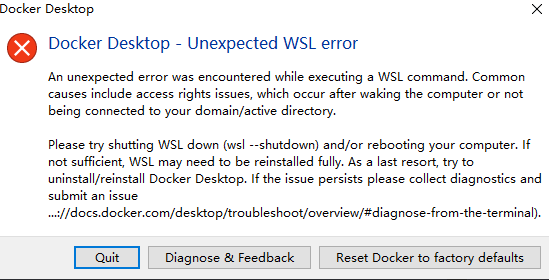

## Windows下启动 Docker 时的错误弹窗

#### 问题描述：

在 windows 中安装 docker 提示以下错误：



#### 解决方案：

需要以管理员的身份运行 `cmd`，输入: 

```shell
$ wsl --update
```


安装成功之后 重启 `docker` 即可完成。

## Vite开发端口映射问题

### 问题描述：

当我们用 docker 启动一个 `vite` 项目，并且进行了端口转发，但是在宿主机并没有访问到。

### 解决方案：

需要在 `vite.config.js` 中的 `server.host` 进行设置：

```js
// https://vitejs.dev/config/
export default defineConfig({
  // ...
  server: {
    port: 5173,
    host: '0.0.0.0', // 切记开启 不然宿主机无法访问容器的端口
  },
})

```

## nodemon 自动加载问题

### 问题描述：

使用 `nodemon` 配合 docker 做本地开发时，保存代码，docker 容器的`node` 服务没有重启。

### 解决方案：

在 node 命令最后加上 `-L` 参数即可。

```shell
$ node src/index.js -L
```

## 无权限安装 node_modules 目录

### 问题描述：

在 Docker 中遇到类似 `permission denied, mkdir '/usr/src/app/node_modules/abbrev'` 这样的错误，意味着Docker 容器在尝试创建或写入目录 `/usr/src/app/node_modules/abbrev` 时遇到了权限不足的问题。在 Docker 容器中安装 `Node` 模块时，npm 需要具有足够的权限去创建`node_modules` 目录及其子目录。

### 解决方案：

1. 使用 `npm ci` 替代 `npm install`

如果是在 `CI/CD` 环境中，考虑使用 `npm ci` 代替 `npm install`，因为 `npm ci` 旨在在一个干净的项目中安装依赖，通常会更快，且在某些情况下可能会减少权限问题。

2. 将 `USER NODE` 放在 `dockerfile`的后面

```dockerfile
FROM node:20-alpine

WORKDIR /app/serve

COPY package*.json ./
RUN npm ci
COPY . .

EXPOSE 4000

USER node

CMD npm run dev:node
```


  

  
