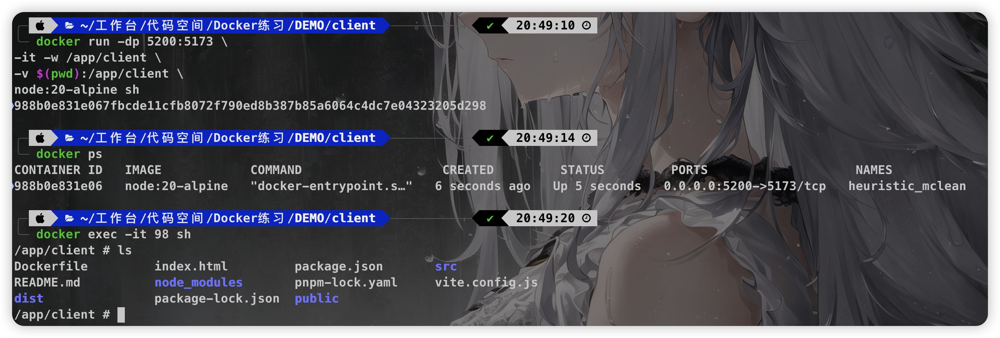

## 项目目录

```shell
├── client # 前端项目
├── public # 存放前端构建后的内容
├── src # 后端主要项目代码
├── userlist.json # 数据文件
├── package.json
└── pnpm-lock.yaml
```

项目根目录下的 `package.json` 的 `script` 和 `client`目录下的 `package.json` 的 `script` 分别如下：

<!-- tabs:start -->

#### **package.json**

```json
{
  // ...
  "scripts": {
    "start": "cross-env NODE_ENV=production PORT=3300 node src/index.js",
    "dev:node": "cross-env NODE_ENV=development nodemon src/index.js",
    "dev:client": "npm run dev --prefix client",
    "dev": "npm-run-all -p dev:*",
    "build:client": "npm run build --prefix client",
    "copy:client": "rm -rf public && cp -r client/dist public",
    "build": "npm-run-all build:client copy:client"
  },
}
```

#### **client/package.json**

```json
{
  // ...
  "scripts": {
    "dev": "vite",
    "build": "vite build",
    "preview": "vite preview"
  },
}
```

<!-- tabs:end -->

如果我们本地有对应的 `node.js` 开发环境，我们要想运行这个项目，只需要运行 `pnpm dev` 即可。那么如果我们本地没有 `node.js` 开发环境，那么如果在进行开发呢？

答案是使用 `Docker`。

接下来我们分几种方法来在 `Docker` 中实现本地开发运行这个项目：

> 首先需要确保 Docker 服务已启动！

## 方法一：使用命令行

> 总结：在命令行中执行命令来运行一个基于 `node:20-alpine` 的容器，将本地目录挂载，并将容器的 `5173` 端口映射到 宿主机的 `5200`，然后在容器的 `shell` 中安装依赖和运行项目。

### 启动前端服务

假设我们现在在项目的根目录上，我们先进入前端对应的文件夹。

```shell
$ cd client
```

然后命令行来启动：

```shell
$ docker run -dp 5200:5173 -it -w /app/client -v $(pwd):/app/client  node:20-alpine sh

# 或

$ docker run -dp 5200:5173 \
-it -w /app/client \
-v $(pwd):/app/client \
node:20-alpine sh

# 或

$ docker run -dp 5200:5173 \
-it -w /app/client \
--mount type=bind,source=$(pwd),target=/app/client \
node:20-alpine sh
```

这行命令的作用是：

1. `-d`：会使得容器在后台以守护进程方式运行，而不会阻塞当前终端窗口。

2. `-p 5200:5173`：将**宿主机**的5200端口映射到容器内的5173端口，使得外部可以通过宿主机的5200端口访问到容器内部5173端口的服务。

3. `-it`：表示在容器内打开一个交互式的TTY（终端）。`-i` 使容器保持打开标准输入（允许交互操作），`-t` 则分配一个伪终端。

4. `-w /app`：设置容器内的工作目录为 `/app`。

5. `-v $(pwd):/app/client`：将宿主机当前目录 (`$(pwd)` 会被替换为当前工作目录的实际路径) 挂载到容器内的 `/app/client` 目录，使得宿主机和容器之间可以共享这个目录下的文件。

6. `node:20-alpine`：指定使用的镜像为 `node:20-alpine`，这是一个基于 Alpine Linux 的 Node.js 环境。

7. `sh`：最后的参数指定了容器启动后执行的命令，这里选择的是启动一个 Bourne shell（sh）。

当执行这个命令后，会启动一个后台运行的 Docker 容器，映射了宿主机的 `5200` 端口到容器的 `5173` 端口，并且进入了容器的 `/app/client` 目录，并将宿主机的当前目录挂载到了容器的 `/app/client` 目录。由于使用了 `-d` 参数，容器会在后台运行，而不会阻塞当前终端窗口。

接下来可以通过 `docker ps` 命令查看正在运行的容器。如果想要进入容器的交互模式，可以使用 `docker exec -it <container_id> sh` 命令，其中 `<container_id>` 是容器的 ID。



这时我们看到我们目前已经在容器内的 `app/client` 目录下，接下来安装依赖并启动项目：

```shell
$ npm i && npm run dev
```

> 原本本地的前端项目并没有 node_modules，安装完成之后我们会发现本地的也会有 node_modules，这时因为我们将本地的目录挂载到了容器中，因此两者会实时同步。

由于将容器内的`5173`端口映射到了宿主机的`5200`端口，因此我们直接在浏览器访问 [http://localhost:5200](http://localhost:5200) 即可看到我们的项目。

接下里我们可以尝试在本地编辑器对代码进行更改和保存，可以发现页面是实时进行更新。

!> 踩坑点：如果你的项目是基于 Vite 进行搭建开发的，切记在 `vite.config.js` 将 `server.host` 改成 `0.0.0.0`，无法宿主机无法访问对应映射的端口。

```js
// vite.config.js
export default defineConfig({
  // ...
  server: {
    host: '0.0.0.0', // 切记开启 不然宿主机无法访问容器的端口
  },
})

```

如果想要退出，直接在容器的终端中输入 `exit` 即可。

### 启动后端服务

假设我们现在**总项目**的根目录上，执行命令运行后端容器：

```shell
$ docker run -it -dp 4000:4000 -w /app/serve -v $(pwd):/app/serve node:20-alpine sh

# 或

$ docker run -it -dp 4000:4000 \
-it -w /app/client \
-v $(pwd):/app/client \
node:20-alpine sh
```

之后使用 `exec` 进入容器后，安装依赖和运行。

```shell
# 以exec的形式进入容器
$ docker exec -it <container_id> sh

# 安装依赖并运行项目
$ npm i && npm run dev
```


## 方法二：使用 Dockerfile

>总结：在前端项目和后端项目的目录上**分别**创建 `dockerfile` 和 `.dockerignore`，然后构建出对应的**镜像**，在运行对应镜像的时候进行本地目录的挂载和端口的映射。

### 启动前端服务

在**前端项目**的**根目录**上创建 `dockerfile` 和 `.dockerignore`：

<!-- tabs:start -->

#### **dockerfile**

```dockerfile
FROM node:20-alpine

RUN mkdir -p /app/client && chown -R node:node /app/client
USER node
WORKDIR /app/client


COPY package*.json ./
RUN npm ci
COPY . .

EXPOSE 5173

CMD npm run dev

```

#### **.dockerignore**

```dockerignore
node_modules
.git
.env*
.DS*
```

<!-- tabs:end -->

进行镜像构建：

```shell
$ docker build -t demo/client .
```

运行这个命令，`Docker` 会根据当前目录下的 `dockerfile` 构建一个新的镜像，并将其命名为 `demo/client`。

!> 踩坑点：如何构建镜像的时候提示：`permission denied, mkdir '/app/client/node_modules/.vite/deps_temp_696265fc'`，是因为没有对应的权限问题，将 `npm install` 改成 `npm ci`。或者将 `USER NODE` 放在操作的最后

运行容器：

```shell
$ docker run -it -dp 5200:5173 -v $(pwd):/app/client -v /app/client/node_modules --name demo-client demo/client
```

这行命令的作用是：

1. `-it`：表示在容器内打开一个交互式的TTY（终端）。`-i` 使容器保持打开标准输入（允许交互操作），`-t` 则分配一个伪终端。

2. `-dp 5200:5173`：将容器的端口 `5173` 映射到宿主机的端口 `5200`，并以后台模式运行容器。

3. `-v $(pwd):/app/client`：将当前目录（宿主机）挂载到容器内的 `/app/client` 目录，使得容器可以访问宿主机的文件。

4. `-v /app/client/node_modules`：挂载一个卷到容器的 `/app/client/node_modules` 目录，通常用于持久化依赖包，以避免在每次启动容器时重新安装依赖。

5. `--name demo-client`：为容器指定一个名称为 `demo-client`。

6. `demo/client`：指定要运行的镜像，即 `demo` 仓库中的 `client` 镜像。

之后在浏览器访问 [http://localhost:5200](http://localhost:5200) 即可看到我们的项目。我们可以尝试一下在编辑器中修改和保存代码，发现是生效的。

### 启动后端服务

在**后端项目**的**根目录**上创建 `dockerfile` 和 `.dockerignore`：

<!-- tabs:start -->

#### **dockerfile**

```dockerfile
FROM node:20-alpine

WORKDIR /app/serve

COPY package*.json ./

RUN npm install

COPY . .

USER node
EXPOSE 4000

CMD npm run dev:node
```

#### **.dockerignore**

```shell
node_modules
.git
.env*
client
.DS*
```

<!-- tabs:end -->

进行镜像构建：

```shell
$ docker build -t demo/serve .
```

运行这个命令，`Docker` 会根据当前目录下的 `dockerfile` 构建一个新的镜像，并将其命名为 `demo/serve`。

运行容器：

```shell
$ docker run -it -dp 4000:4000 -v $(pwd):/app/serve -v /app/serve/node_modules --name demo-serve demo/serve
```

### 进阶：使用 docker compose

> Docker Compose 是 Docker 官方提供的一个工具，用于定义和运行多容器 Docker 应用程序。它通过一个配置文件（通常命名为 `compose.yml`）来定义应用程序的服务、网络、存储卷等配置，然后使用简单的命令即可启动、停止、重建整个应用程序。
>
> 使用 Docker Compose 可以方便地管理多个容器的应用程序，而不需要手动执行多个 `docker run` 命令来启动各个容器。它提供了一种更加简洁、易于理解和维护的方式来管理复杂的应用程序。

在**总项目**的根目录上，创建 `compose.yaml`:

```yaml
# compose.yaml
services:
  app-client:
    build: ./client
    ports:
      - 5200:5173
    volumes:
      - ./client:/app/client
      - /app/client/node_modules
  app-serve:
    build: .
    ports:
      - 4000:4000
    volumes:
      - .:/app/serve
      - /app/serve/node_modules
```

在命令行中运行：

```shell
$ docker compose up -d --build
```

- `up`：启动应用程序的容器。如果容器已经存在，它会重新启动已经停止的容器。
- `-d`：在后台模式下启动容器，即在后台运行容器，并且不会将容器的输出打印到终端。
- `--build`：在启动容器之前，强制重新构建 `Dockerfile` 中定义的镜像。通常情况下，如果已经存在构建好的镜像，Compose 会尝试直接使用这些镜像启动容器，而不会重新构建。