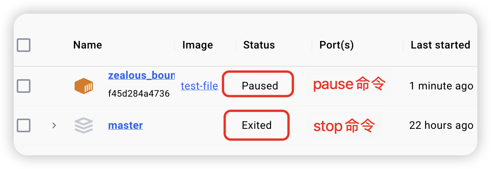

## 容器的基本操作

| 操作                        | 命令(全)                                | 命令(简)                      |
| --------------------------- | --------------------------------------- | ----------------------------- |
| 容器的创建                  | docker container run <image name>       | docker run <image name>       |
| 容器的列出(up)              | docker container ls                     | docker ps                     |
| 容器的列出(up和exit)        | docker container ls -a                  | docker ps -a                  |
| 容器的停止                  | docker container stop <name or ID>      | docker stop <name or ID>      |
| 容器的删除                  | docker container rm <name or ID>        | docker rm <name or ID>        |
| 容器的重启                  | docker container restart <name or ID>   | docker restart <name or ID>   |
| 容器的日志输出[-f 实时输出] | docker container logs [-f] <name or ID> | docker logs [-f] <name or ID> |

## 操作示例

```shell
# 运行一个Nginx的容器
$ docker container run nginx
# 或
$ docker run nginx

# 列出当前运行的容器
$ docker ps 
# 或
$ docker container ls
CONTAINER ID   IMAGE     COMMAND                   CREATED         STATUS         PORTS     NAMES
af55ba7ce652   nginx     "/docker-entrypoint.…"   6 seconds ago   Up 6 seconds   80/tcp    tender_hofstadter

# 列出所有的容器，包含已经退出的
$ docker ps -a
# 或
$ docker container ls -s
CONTAINER ID   IMAGE     COMMAND                   CREATED          STATUS                    PORTS     NAMES
af55ba7ce652   nginx     "/docker-entrypoint.…"   39 seconds ago   Up 39 seconds             80/tcp    tender_hofstadter
7a988527a45e   nginx     "/docker-entrypoint.…"   22 hours ago     Exited (0) 22 hours ago             brave_sammet

# 删除那个已经暂停的容器 (根据容器ID前几位来删除)
$ docker rm 7a
7a

# 删除正在运行的容器 需要加上 -f 参数，会先停止运行，然后删除
$ docker rm -f af

# 列出所有的容器，包含已经退出的
$ docker ps -a

# 暂停ID以af开头的容器
$ docker container stop af
# 或
$ docker stop af
```

### `docker container run` 背后发生了什么？

```shell
$ docker container run -d --publish 3000:80 --name webhost nginx
```

1. 在本地查找是否有`nginx`这个`image`镜像，但是没有发现
2. 去远程的`image registry`查找nginx镜像（默认的`registry`是`Docker Hub`)
3. 下载最新版本的`nginx`镜像 （`nginx:latest` 默认)
4. 基于`nginx`镜像来创建一个新的容器，并且准备运行
5. `docker engine`分配给这个容器一个`虚拟IP`地址
6. 在宿主机上打开`3000`端口并把容器的`80`端口转发到宿主机上
7. 启动容器，运行指定的命令（这里是一个`shell`脚本去启动`nginx`）

`docker run` 可以也可以理解为是 `docker create` 和 `docker start` 的组合命令，先创建容器，再运行容器。

## 容器的ID和Name

我们运行一个容器：

```shell
$ docker run -itd ubuntu /usr/bash  -c "while true; do sleep 1; done"
c3a46a6a9d50e05e835b77abSab5a003e472753a0c031505e7a89be3aa241
```

上面命令的意思是运行一个ubtntu运行， `while` 语句让 `bash` 不会退出，在后台运行。

如果我们运行 `docker ps` ，可以得到容器的 CONTAINER ID 和 NAMES 两个字段。
CONTAINERID 是容器的“短ID” ，前面启动容器时返回的是“ 长ID”。短ID是长ID 的前12 个字符。
NAMES 字段显示容器的名字，在启动容器时可以通过--name 参数显式地为容器命名，如果不指定，docker 会自动容器分配名字。

## 批量操作

首先，我们先列出来所有正在运行的容器。

```shell
# 查看当前运行的容器
$ docker container ps
CONTAINER ID   IMAGE     COMMAND                   CREATED          STATUS                    PORTS     NAMES
af55ba7ce652   nginx     "/docker-entrypoint.…"   39 seconds ago   Up 39 seconds             80/tcp    tender_hofstadter
7a988527a45e   nginx     "/docker-entrypoint.…"   22 hours ago     Exited (0) 22 hours ago             brave_sammet
```

### 批量暂停

方法一：根据`容器ID`进行暂停。

这种方法可以暂停任意指定的容器，但是当要暂停当前所有正在运行的容器时，就会显示很繁琐且无力。

```shell
# 挨个输入ID进行暂停
$ docker container stop af 7a
```

方法二：先使用`docker container ps -q`输出所有的正在运行的容器。然后在使用`docker container stop`进行暂停。

```shell
# 输出正在运行的容器ID
$ docker container ps -q
1061253f2b1e
af61253f2b1e

# 暂停所有正在运行的容器
$ docker container stop $(docker container ps -q)
# 或
$ docker stop $(docker ps -q)
```

### 批量删除

> 注意：无法删除一个正在运行的容器，需要先将其进行暂停，再进行删除。也可以带上 -f 来强制删除容器，其操作是先暂停，后删除。

方法一：根据`容器ID`进行删除

这种方法可以删除任意指定的容器，但是当要暂停当前所有正在运行的容器时，就会显示很繁琐且无力。

```shell
# 挨个输入ID进行删除
$ docker container rm af 7a
```

方法二：先使用`docker container ps -aq --filter status=exited`输出所有的已退出的容器。然后在使用`docker container rm`进行删除。

```shell
# 输出所有的已退出的容器ID
$ docker container ps -aq --filter status=exited
1061253f2b1e
af61253f2b1e

# 删除所有已退出的容器
$ docker rm $(docker ps -aq --filter status=exited)
```

## 容器运行的各种模式

### attach 模式

```shell
# 运行一个nginx容器，并且容器的80端口映射到外部主机的8080端口
$ docker run -p 8080:80 nginx
```

- 透过这种方式创建容器的话，容器在前台执行
- 容器的输入输出结果会反映到本地端，本地端的输入输出也会反映到容器，例如能在终端机看到网页浏览器`http://localhost:8080`的 `log`，`ctrl + c `会让容器停止执行
- 一般情况**不推荐**使用

### detach 模式 (推荐)

```shell
# 后台以守护进程方式运行容器
$ docker run -d -p 8080:80 nginx
```

- 容器会在后台执行

使用`datach`模型后，我们无法直接在终端中查看到相关日志的打印，接下来我们来学习如果在`datach`模式下查看日志信息。

## 容器的交互模式

### 查看某个容器的日志信息

```shell
# 查看容器的日志信息记录
$ docker container logs <容器ID>
# 或
$ docker logs <容器ID>

# 实时查看容器的日志信息 
$ docker container logs -f <容器ID>
# 或
$ docker logs -f <容器ID>
# 如果想退出实时查看 直接 Ctrl+C 退出即可
```

### 创建一个容器并进入交互式模式

```shell
# 运行一个基于Ubuntu镜像的新容器，并进入该容器的交互式Shell环境
$ docker container run -it ubantu sh

# 在容器内部执行 sh 命令，即启动一个Bash shell。这意味着当容器启动后，我们可以直接与Ubuntu系统内运行的Bash shell交互的会话
```

### 在一个已经运行的容器里执行一个额外的command

```shell
$ docker container run -d nginx
33d2ee50cfc46b5ee0b290f6ad75d724551be50217f691e68d15722328f11ef6

$ docker container exec -it 33d sh
#
#
# ls
bin  boot  dev  docker-entrypoint.d  docker-entrypoint.sh  etc  home  lib  lib64  media  mnt  opt  proc  root  run  sbin  srv  sys  tmp  usr  var
#
# exit
```

## 资源限制

一个 `docker host` 上会运行若干容器，每个容器都需要 CPU、内存和 IO 资源。对于KVM、VMware 等虚拟化技术，用户可以控制分配多少 CPU、内存资源给每个虚拟机。对于容器，Docker 也提供啦类似的机制避免某个容器因占用太多资源而影响其他容器乃至整个 host 的性能。

### 内存限额

与操作系统类似，容器可使用的内存包括两部：物理内存和 swap。Docker 通过下面两组参数来控制容器内存的使用量。

(1) `-m` 或`--memory`：设置内存的使用限额，例如100MB，2GB。

(2) `-memory-swap`：设置内存 `swap` 的使用限额。

当我们执行如下命令:

```shell
$ docker run -m 200M --memory-swap=300M ubuntu
```

其含义是允许该容器最多使用20MB 的内存和100MB的 swap。默认情况下，上面两组参数为 -1 ， 即对容器内存和 swap 的使用没有限制 。

分配的内存超过限额，stress 线程报错，容器退出。

如果在启动容器时只指定 `-m` 而不指定 `--memory-swap`，那么 `-memory-swap` 默认` -m` 的两倍，比如:

```shell
$ docker run -it -m 200M ubuntu
```

容器最多使用 200MB 物理内存和 200MB swap。

#### CPU 限额

默认设置下，所有容器可以平等地使用 hostCPU 资源并且没有限制。

Docker 可以通过 `-c` 或 `--cpu-shares` 设置容器使用CPU的权重。如果不指定，默认值为 1024。

与内存限额不同，通过 `-c` 设置的 `cpu share` 并不是CPU 资源的绝对数量，而是一个相对的权重值。某个容器最终能分配到的CPU资源取决于它的 `cpu share` 占所有容器 `cpu share` 总和的比例。

换句话说：通过 `cpu share` 可以设置容器使用 `C P U`  的优先级。

比如在 host 中启动了两个容器:

```shell
$ docker run --name "container_A" -c 1024 ubuntu docker run --name "container_B" -c 512 ubuntu
```

`containerA` 的 `cpu share`  1024，是 `containerB` 的两倍。当两个容器都需要 CPU 资源时， `containerA` 可以得到的 `CPU` 是 `containerB` 的两倍。

## docker stop 和 docker pause 的区别

`docker stop` 和 `docker pause` 都是用来控制 Docker 容器运行状态的命令，但它们的作用机制和用途有所不同：

**docker stop**：

- **目的**: 用来停止一个正在运行的 Docker 容器。
- **行为**: 当执行 `docker stop` 命令时，Docker 会向容器内的主进程发送 SIGTERM 信号，这通常意味着通知应用程序优雅地关闭。如果容器在指定的等待时间（默认10秒）内没有自行退出，Docker 将发送 SIGKILL 信号强制结束容器，导致容器立即停止。
- **结果**: 容器停止后，其内部进程完全终止，资源释放，容器进入“Exited”状态。

**docker pause**：

- **目的**: 用来暂停容器内的所有进程，而不是彻底停止容器。
- **行为**: 当执行 `docker pause` 命令时，Docker 使用 cgroups 冻结功能（在Linux系统中）暂时挂起容器中的所有进程，这意味着进程不会消耗CPU资源，也不会进一步执行任何操作，但是它们的内存状态会被保存。
- **结果**: 容器进入“Paused”状态，但并没有真正退出，只是暂时不可达和不活动。可以通过 `docker unpause` 命令随时恢复容器的运行，这时容器内的进程会从暂停点继续执行，保持了暂停前的状态。



总结来说，`docker stop` 更像是关机操作，而 `docker pause` 类似于电脑的休眠模式。`stop` 后需要重新启动容器才能继续工作，而 `pause` 和 `unpause` 可以实现快速的暂停和恢复，常用于临时性的资源管理或维护操作。