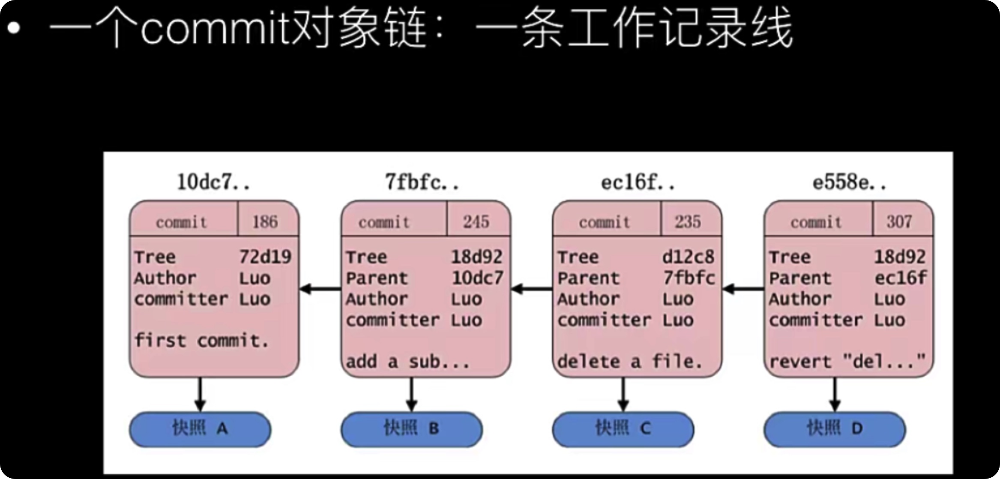
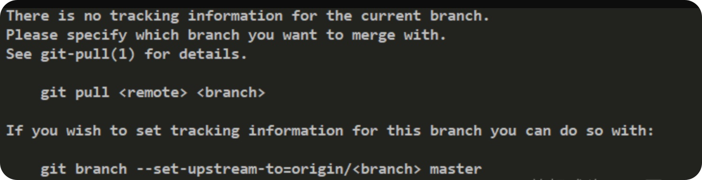
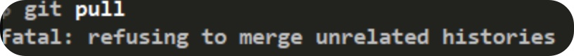

## Git 知识点

### Git 流程

```js
1. 先将本地编辑器代码提交到本地暂存区
git add file

2. 将暂存区的文件提交到本地仓库
git commit -m '版本日志信息' 文件名

3. 将本地仓库代码推送到远程仓库代码中
git push -u orign master

// 因此存在三种状态

已修改
	在工作目录修改Git文件
已暂存
	对已修改的文件执行Git暂存操作，将文件存入暂存区
已提交
	对已暂存的文件执行Git提交操作，将文件存入版本库

对于空的目录，git不会将他们进行提交，自动忽略
```

### Git 基本知识

```shell
# 清空面板里的所有内容
CTRL+L 或 clear

# 详细查看当前本地的工作区的文件
ll

# 查看当前本地的工作区的文件
ls

# 查看当前本地的工作区的文件包括隐藏文件
ls -a

# 新建文件
touch index.txt

# 编辑文件
vi index.html

# 新建并且编辑文件
vim index.html
摁下i，代表进入insert插入模式，即可在编写内容

# 退出编辑并且保存
摁下 esc， 输入 :wq 回车即可

# 查看文件里面的内容
cat index.html

# 创建文件夹
mkdir locgit

# 复制文件
cp text.txt  text2.txt

# 删除文件
rm text.txt

# 删除文件夹，并且递归删除文件夹下面的所有文件
rm -rf text

# 使用vim编辑文件时间，摁下esc，输入 : set number 可以设置内容的行号 输入 : 7 可以快速跳转到第7行

# 快速删除4~10的内容
我们可以 :4 然后按下dd，然后挨个删除，也可以 :4, 10d 来直接删除

# 快速删除vim下的内容 摁下 dd,即可删除一行

# 文件重命名 将index.html 改为 index2.html
mv index.html index2.html

# 编辑内容替换到文件里面的所有内容，没有文件则创建该文件
echo '覆盖的内容' > index.html
# 内容追加
echo '追加到最后的内容' >> index.html

# 查看当前文件所在目录及文件夹
pwd


# Git在提交的时候需要个人用户名和个人邮箱，在三个地方分别可以配置

# 1. 不设置的话 会利用系统的
1. /etc/gitconfig (几乎不用) git config --system
# 2. 全局的配置，每一个Git仓库都将默认使用这个
2. ~/ .gitconfig (很常用) git config --global
# 3. 针对特性项目的 （权重最高）
3. .git/config文件中 git config --local

# 全局配置和查看
git config --global user.name '新新小朋友'
git config --global user.email 'hjx@com'

# 当前仓库配置和查看
git config --loacl user.name 'WEB'
git config --local user.email 'hjxweb@com'

# 查看被使用的用户名和邮箱
git config user.name
git config user.email


# 在我们切换Git指令的时候，可以通过键盘的上下切换进行修改，当我们要修改头部的内容的时候，可以摁住 CTRL + A 让光标移动到指令最前面， 摁住 CTRL + E 让光标跳到最后
CTRL + A // 光标移动到最前方
CTRL + E // 光标移动到最后方

# &&操作符
# 创建dist文件夹并且进入dist文件夹
mkdir dist && cd dist

```

### Git 指令

```shell
# 查看是否有需要添加值暂存区的内容
git status
或
git status -s

# 将已修改的内容添加至暂存区中
git add .

# 将已添加到暂存区的文件删除
git rm --cached index.html

# 将暂存区的文件提交到本地仓库中
git commit -m '提交描述' index.html

# 将工作区的文件提交暂存区并且提交到本地仓库
git commit -am '提交描述'

# 查看所有提交信息标题
git log --pretty=oneline

# 查看所有提交信息 提交人 提交时间 已经提交标题
# "%h - %an, %ar : %s" 格式： 索引 - 作者, 时间 ： 标题
git log --pretty=format:"%h - %an, %ar : %s"
效果如下：
a089f44 - 新新小朋友, 8 minutes ago : 更改之后的标题
710331a - 新新小朋友, 18 minutes ago : 删除index.txt
c0040ca - 新新小朋友, 27 minutes ago : 第一次提交，创建了index.js和index.txt文件

# 查看分支以及合并的情况
git log --graph

# 显示上一次文件修改者和修改内容，特别适合多人合作
git blame 文件名

# 更新上一次提交的作者和邮箱
git commit --amend --reset-author

# 删除已提交至缓存区的内容
git reset HEAD index.html

# 删除已修改的部分 针对工作区
git checkout -- index.html

```

### Git 初始化

```js
// 进入要进行Git操作的文件夹下

// 1. 初始化Git
git init

// 查看当前本地的工作区的文件
ls

// 2. 查看本地库状态
git status
// 查看具体的未提交信息
git status -s

// 3. 将代码添加至暂存区
git add (后面跟要添加的文件名称)
git add . (代表提交所有)

// 从暂存区中删除添加的内容
git rm --cached (后面跟要添加的文件名称)

// 4. 提交本地库
git commit -m '版本日志信息' 文件名

// 5. 查看本地版本信息
// 节略查看
git reflog
// 详细查看
git log
```

### commit 对象链和分支关系

```tsx
commit版本信息是一条对项链，每个对象链有一个parent属性（第一个没有），里面保存上上一次commit的ID值

一共有两个指针
HEAD 指向当前的分支
master 指向当前最后一次提交（默认）

HEAD => master  => 提交

当我们创建一共新的分支 dev ，Git并没有将旧的分支上的信息复制一份到新的分支上，而是新创建了一个指针来指向 当前的旧分支指向的提交 如下图

									(master)
⚪ ———— ⚪ ———— ⚪
				HEAD =>	(des)


然后当前指针引用变成如下：
HEAD => dev  => 提交
```



### git checkout -- hello.txt 使用

```shell
# 命令git checkout -- readme.txt意思就是，把readme.txt文件在工作区的修改全部撤销，这里有两种情况
# 一种是readme.txt自修改后还没有被放到暂存区，现在，撤销修改就回到和版本库一模一样的状态；

# 一种是readme.txt已经添加到暂存区后，又作了修改，现在，撤销修改就回到添加到暂存区后的状态。

# 总之，就是让这个文件回到最近一次git commit或git add时的状态。
```

### 暂存区撤销到工作区

```shell
# 可以把暂存区的修改撤销掉（unstage），重新放回工作区
# 方法一：
git reset HEAD <file>
# 方法二： 这种方法也可以丢弃工作区的修改
git restore --staged <file>

```

### 版本穿梭

```js
// 查看操作日志
git reflog

// 查看提交日志
git log

// 回退上一个版本
git reset --hard HEAD^
git reset --hard HEAD~1

// 版本穿梭
git reset --hard 要穿梭版本的版本号

// 版本回退 取消这次提交
git reset 需要回退到的版本号
虽然版本回退了，并且commit提交记录也会随着删除，但是当前的内容不会更改
```

### 分支操作

```shell
# 创建分支
git branch 分支名

# 查看分支
git branch

# 显示所有分支最新一条提交消息
git branch -a

# 显示本地仓库分支和连接的远程仓库的所有分支最后一个提交的id和信息
git branch -av

# 切换分支
git checkout 分支名
git switch 分支名

# 切换上一次切换的分支
git checkout -
git switch -

# 创建新分支 并且切换为改分支
git checkout -b 分支名
git switch -c  分支名

# 创建新分支且切换到创建的新分支上，并且新分支是基于某个远程仓库分支进行创建的
git checkout -b develop origin/develop

# 删除分支
# 删除已合并的
git branch -d 分支名
# 删除未合并的分支
git branch -D 分支名

# 删除远程仓库的分支 (删除hotfix)
git push origin :hotfix

# 分支重命名
git branch -m 旧的分支名 新的分支名

# 把指定的分支合并到当前分支上(需要先进入当前分支)
git merge 分支名

# 合并冲突 (当两块代码都做了修改)
<<<<<<< HEAD(代表当前指针指向的分支)(代表==上面是master冲突的部分)
   这是mater修改
=======
   这是dev修改
>>>>>>> dev (代码==下面是dev分支冲突的部分)

# 然后手动的进行文件合并 就是删除掉提示符号和保留决定合并的代码
# 然后 git add 文件名
# 然后 git commit -m '版本的版本信息' 这里不能带文件名


# 强制合并，如果合并冲突的话，只保留当前分支的信息，而舍弃被合并分支的内容，并且无需add和commit
git merge --abort


```

### 远程仓库操作（GitHub）

```shell
# 查看当前所有远程地址别名
git remote

# 查看当前所有远程地址别名和远程地址
git remote -v

# 起别名 默认为 origin
git remote add 别名 远程地址

# 远程仓库重命名
git remote rename origin origin2

# 删除远程仓库
git remote rm origin

# 首次推送本地分支上的内容到远程仓库 -u 表示本地master与远程master关联
git push -u origin master

# 远程创建分支 （将本地hotfix推送到远程，并且在远程创建hotfix）
# 方法一： 将本地的分支hotfix推送远程，默认创建一个同名的分支
git push origin hotfix
# 方法二：
git push origin hotfix:hotfix (本地分支：远程分支)
# 方法三： 默认将当前分支 推送到远程，如果远程没有则创建同名的本地分支
git push

# 删除远程分支 (hotfix)
# 方法一
git push origin :hotfix
# 方法二：
git push origin --delete hotfix

# 将远程仓库的内容克隆到本地
git clone 远程地址

# 更新本地的 所有 远程仓库分支，但是不会直接更新到界面
git pull

# 创建本地分支并且与远程分支建立关系，仅在clone整个仓库时可用，pull不行
# 方法一：
git checkout -b develop origin/develop
# 方法二：
git checkout --track origin/develop

# 将远程仓库对于分支最新内容拉下来后与当前本地分支进行合并
git pull origin 远程分支:本地分支

# 如果git pull提示no tracking information，则说明本地分支和远程分支的链接关系没有创建，用命令
git branch --set-upstream-to <branch-name> origin/<branch-name>。

```

### 生成 SSH 密钥和公钥

```shell
# 进入window的家目录
# 1. C:\Users\admin

# 2. 右击Git Bash Here

# 3. 运行命令生成.ssh密钥目录 (现在无需再生成，只需要直接查看即可)
ssh-keygen -t rsa -C 2719382032@qq.com
# 或
ssh-keygen -t ed25519 -C 2719382032@qq.com

# 4. 查看公钥
cd
cd .ssh
ls
cd id_rsa.pub

# 当前公钥
ssh-rsa AAAAB3NzaC1yc2EAAAADAQABAAABgQC0UviYvlR7MuvwD65PAZq7NEjzgAEG5ckgcVohLMPddDELED7+tSIlwuhJzjnrqsN97o285p1T9OGRulyWhm9Rn5wCDf3bFvQf3+yIJf6Qj3Ez6rprTg5xkT3St8ANoVE2LrSxK0vbVCUhNqXt5x47jG/7fe+6JrRtRwOyjl/XhBvw5F6sFF26K+1eIT1HEdcTPELFA0870j0+6Ch0xWVheKBqzTfKClZVuVOX6hHt6dvly8qy9IOYv35n/GBmbIi5O4rvt0S2ZZgULLGwzpVIMn/PzH8HDt/cknYySmZfr/TA+NwZWCuVHaBfY+JWkPmS//yNea4EmRISEGK5P7fvTBrbI5fw0pNZkS1/tH2hNWjh2nL2hYJGwW3lf5dUI4PXQJRrGKOejM41wIwaK/jDrMdbrw1dVGA6jH2v0Ug0n/ywaCLvhscTl06ShNJEXuGoVf0OfmQuLPVkKSLCDN1MO6H15YbhhC7VvHRH97yM/FcS+kwZWCIJ8PkfjMOj46k= 2719382032@qq.com


```

### 查看用户名和邮箱

```shell
git config -l

# 查看的用户名和邮箱
git config --global user.name
git config --global user.email

# 查看本地当前项目的用户名和邮箱，不设置默认为空
git config --local user.name
git config --local user.email

```

### git rm 和 rm 的区别

```jsx
git rm 在未提交到本地仓库的代码无法删除

并且git rm删除文件之后还原需要两步
git restore --staged index.js
git restore index.js


rm 删除之后还原需要一步
git restore index.js


git rm:
1. 删除了一个文件
2. 将删除的文件纳入到暂存区，也就是无需再次提交到暂存区，可以直接提交给本地仓库

rm:
1. 删除了一个文件
2. 并未将删除的文件纳入暂存区，无法直接commit，需要先纳入暂存区

```

### git mv 和 mv 的区别

```tsx
// 这两个指令的作用都是给文件重命名

先删除旧文件 然后创建新的文件并且将旧的文件拷贝到新的文件上

git mv:
1. 文件重命名
2. 将重命名的文件纳入暂存区，我们直接可以commit到本地仓库

mv:
1. 文件重命名
2. 并未将重命名的文件纳入暂存区，我们需要还纳入暂存区，才能commit

// 撤销
1. 先将被删除的旧文件弄回来
git restore index.js(原文件名称)
2. 这时会有两个文件，一个重命名之前的旧文件，一个重命名之后的新文件
3. 然后删除重命名之后的新文件 rm
```

### 更改 commit 的消息

```tsx
// 加入我们commit到本地仓库的时候，消息标题写错了，可以利用修改上一条消息标题
git commit --amend -m '更改之后的标题'


```

### .gitignore 忽略文件

```tsx
// 忽略文件 不会被添加到暂存区和本地仓库
支持正则 通配符

# #代表注释

// 忽略node_modules
/node_modules

// 忽略所有less文件
*.less

// 不忽略index.less
// ! 取反
!index.less

// 忽略build文件夹所有文件
build/

// 忽略doc/notes.txt 当不包括doc/server/ss.txt
doc/*.txt
```

### pull 使用

```shell
# 拉去代码仓库下的某一个分支的代码
# 需要先初始化
git init
git pull 远程仓库地址 分支名

git pull === git fetch + git merge
git fetch # 获取远程仓库最新的修改，并且拉取到本地
git merge # 将远程的修改合并到你当前的代码库中
```

### 保存工作现场

```tsx
// 开发需求，当前一共有两个分支，一个master， 一个dev，当我们正在dev分支上开发的时候，需要修改master分支上的内容的时候，我们可以选择先commit dev分支上的内容，再选择切换，但是工作中，但凡commit都是开发完成或者测试通过的，所以我们需要将当前dev的状态缓存起来

// 保存当前的开发进度，但是打印的时候并不是显示当前的进度，而是上次提交的内容
git stash save '保存的描述'

// 列出所有保存的开发进度
git stash list

// 将之间保存的最新状态恢复,并且将改状态删除掉
git stash pop

// 将之前保存的最新状态恢复，但是不删除改状态
git stash apply

// 恢复保存的指定状态
git stash apply stash@{1}

// 手动删除保存的记录
删除保存的索引为1的记录
git stash drop stash@{1}
```

### Git 标签(版本)

```shell
# 我们在查看vue或者其他框架的时候，会出现一共tags，这个就是标签

# 标签不会随着当前分支的转移而发生变化，不是依赖于特定的某一个分支的

# 默认标签是打在最新提交的commit上的。有时候，如果忘了打标签，比如，现在已经是周五了，但应该在周一打的标签没有打，怎么办？
#方法是找到历史提交的commit id，然后打上就可以了：


# 标签总是和某个commit挂钩。如果这个commit既出现在master分支，又出现在dev分支，那么在这两个分支上都可以看到这个标签。

# 创建一个轻量级的标签
git tag v1.0.0

# 创建一个带标注的标签
git tag -a v1.0.1 -m '1.0.1版本'

# 查看创建的标签
git tag

# 查找标签
# (精确查找)
git tag -l 'v1.0.0'
# (模糊查找)
git tag -l 'v*'
# 查看具体某一个标签的详细信息
git show v1.0.0

# 删除标签
git tag -d 标签名称

# 推送远程标签
# 一次推送一个
git push origin v1.0.0
# 一次推送多个
git push origin v1.0.1 v1.1.0
# 将本地所有标签推送到远程
git push origin --tags
# 指定别名推送，上面都是默认推送，下面这是语法糖，但是允许标签名不一致
git push origin refs/tags/v1.0.0:refs/tags/v1.1.0

# 获取远程所有标签
git pull

# 删除远程标签
# 方法一：
git push origin :refs/tags/v1.1.0
# 方法二：
git push origin --delete tag v1.0.1
```

### diff 使用

```shell
# 差异性 用来比较两个文件之间的不同，并且把这些不同列出来

# 比较两个文件的差异性
diff 原文件 目标文件

# 比较两个文件，并且	新文件咋样修改可以改成原文件 b咋样操作可以改为a文件
diff -u a b

# 比较暂存区和工作区的文件
# 暂存区经过怎么样的操作可以达到工作区的水平
git diff

# 比较工作区于特定id的仓库的文件
git diff HEAD
# 比较工作区和特定版本的区别
git diff commit_ID

# 比较暂存区与提交的区别
# 比较暂存区与最新提交区的比较
git diff --cached
# 比较暂存区与指定提交区的比较
git diff --cached commit_id
```

### 基于 Git 分支的开发模型

```shell
# 基于Git分支的开发模型
	develop分支 (频繁变化的一个分支)
	test分支 (供测试与产品等人员使用的一个分支，变化不是特别频繁)
	master分支 (生产发布分支，变化非常不频繁的一个分支)
	bugfix(hotfix)分支 (生产系统当中出现了紧急Bug，用于紧急修复的分支)
```

### gitk 使用

```shell
# 一个以图形化界面展示提交的版本信息和提交者信息以及分支和分支合并情况

# 调用gitk
gitk
```

### git gui

```shell
# 查看当前版本仓库信息 未缓存未提交等信息

# 调用
git gui

```

### 指令别名

```shell
# 假设给 git branch 起别名 git br
git config --global alias.br branch

# 查看自己配置的别名
vi ~/.gitconfig
# 在 [alias]里面存放的就是配置的别名

# 配置命令
git config --global alias.ui '!gitk'
```

### 多个远程仓库协作

```shell
# 将一个git仓库引入到另外的一个git仓库里面
git submodule add 另外的一个git远程仓库地址 将另外一个仓库拉去之后发在文件夹的名称
git submodule add http@git my-modules

# 例如我们项目里面有多个模块，比如聊天模块是公共模块，我们可以引入聊天模块，当聊天模块发生更改时，我们只需要在当前主项目进入聊天模块的文件夹，输入 git pull 即可拉取最新的内容

# 一次性获取当前主项目中所有引入模块的更新，无需进入子模块文件夹
git submodule foreach git pull

# 当团队的新成员clone主项目的时候，submodule不会自动安装，需要执行两个命令，在项目根目录，而非模块目录
# 克隆仓库到本地
git clone 仓库地址 本地存放的文件夹
# 初始化submodule
git submodule init
# 递归更新submodule
git submodule update --recursive
# git submodule update  --recurse-submodules

# 一次性安装所有submodule


```

### git subtree

```shell
# 跟git submodule功能一致，但是推荐使用subtree代替submodule

# 父工程和子工程可以双向的修改子工程的内容

# 使用方法 （主项目）
# 1. 先添加新的子模块仓库
git remote add new_module 仓库地址

# 2. 关联子模块
# --squash作用是将子模块多次提交合并为一个提交，可以防止子模块的提交历史污染主项目的提交
git subtree add --prefix=将被关联的模块放在本地的文件夹的名称 上面添加的子模块仓库地址 克隆的分支 --squash
git subtree add --prefix=subtree/new_module new_module master --squash

# 当主项目碰见需要更新子模块内容的需求时，可以直接需求子模块的内容，然后先提交主项目的修改，然后再更新子模块的修改
# 在主项目中更新子模块的修改
git subtree push --prefix=subtree/new_module new_module master --squash
w
# 在主项目获取最新的子模块
git subtree pull --prefix=subtree/new_modeule new_module master --squash


```

### --squash 使用

```shell
# 是merge或者引入外部模块时的一个可选参数，目的是将子模块或者被合并的分支的多次提交合并为一个提交，这样可以做到避免污染全局（主项目）的提交历史。

# 注意：
# 如果使用 --squash，那么就要一直使用，不然一定会出错。要不就全部不使用
```

### cherry-pick

```shell
# cherry-pick针对提交，merge针对分支

# 用于将某一个分支上已提交的修改运用到另外一个分支上，这个和merge的最大区别是，merge会合并最新的提交，并且生成新的提交，这个可以复制指定的提交，但是如果复制的不是相邻的提交，那么也会报合并冲突的情况，需要手动处理合并冲突

# 当前分支未修改的情况下，使用cherry-pick，如果当前分支也进行修改，使用merge合并

# 在master分支上修复的bug，想要合并到当前dev分支，可以用git cherry-pick <commit>命令，把bug提交的修改“复制”到当前分支，避免重复劳动。


git cherry-pick commitID序号
```

## 常用指令

### git stash

```js
// 暂存，当我们同时开发了几个需求，但是只要提交一个已完成的需求，可以先将已经开发好的需求 git add到暂存区，然后进行 git commit 本地提交，然后执行git shash 进行对其它未开发完成的项目进行暂存，这个时候我们发现工作区待添加到暂存区的代码全部消失了，也就是开发的代码消失了，先进行 git push 远程推送，等推送完成，再执行 git stash pop 将暂存区的最新的代码弹出即可

git stash save 'xxx' // 存储变更，此时基于上次的合并分支，未提交的代码将被暂存起来
git stash list  // 查看存储区的所有提交列表
git stash pop // 弹出并应用最新的一次存储区的代码提交
git stash drop stash@{n} // 删除某次存储的信息
git stash clear // 清楚所有stash信息
```

### git clone

```js
// 将远程仓库的代码克隆到本地，默认是master分支， 默认只能看见当前的分支

git clone xxx.git // 默认会克隆到当前文件夹的 以项目名称为文件夹命名的位置上，
git clone xxx.git dome // 这将会将目标项目克隆到 命名为 dome 这个文件夹下，默认是master分支
git clone xxx.git -b develop dome2 // 将目标项目克隆到 dome2 文件夹，并且克隆的 develop 分支
```

### git remote

```js
// 用于和远程仓库进行关系绑定处理

git remote add origin xxx.git // 将 xxx.git 远程地址添加到 命名为 origin 的远程仓库下
git remote remove xx // 删除 xx 远程仓库

```

### git branch

```js
// 用来查看当前项目 本地和远程的分支数量

git branch // 查看本地的所有分支
git branch -r // 查看远程仓库的所有分支
git branch -a // 查看本地和远程仓库的所有分支
git branch -d xxx // 删除 xxx 的本地分支

git branch --merged // 查看所有合并到当前分支的分支
git branch --no-merged // 查看所有没有合并到当前分支的分支
```

### git switch

```js
// 用来新建、切换以及从远程仓库上拉取其它的分支

git switch -c xxx // 在原有的基础上创建一个新的分支并切换过去
git switch -c develop origin/develop // 在本地创建develop分支，并且将远程仓库的develop切到当前分支上
```

### git checkout

```js
// 用来新建、切换以及从远程仓库上拉取其它的分支

git checkout -b xxx // 在原有的基础上创建一个新的分支并切换过去

git checkout -b develop origin/develop // 在本地创建develop分支，并且将远程仓库的develop切到当前分支上进行关联
git checkout develop // 这种方式为上面的简写
```

### git add

```js
// 在当前分支上更改了代码，将工作区的代码添加到暂存区

git add [file1] [file2] // 将多个文件添加到暂存区
git add .  // 将当前目录下所有的改动添加到暂存区
git add -A // 把当前仓库内所有文件改动添加到暂存区
```

### git commit

```js
// 将暂存区的文件添加到本地仓库

git commit -m 'xxxx' // 将当前的暂存区内容提交到本地仓库，提交信息为 xxxx

```

### git rm

```js
// 用来删除本地或已提交到远程仓库的文件

// 在本地中，我们不小心提交了一个 .env 的文件，但是该文本我们不想提交到远程仓库，因此我们需要将该文件添加到 .gitignore，用来告诉git我们忽略提交该文件，但是由于我们已经提交过了，因此并不会生效。
// 我们可以直接在远程仓库中点击右键删除，然后本地下一次提交的时候，依然会带上该文件，原因是本地仓库依然存在改文件，因此我们不在远程仓库进行删除，而是在本地仓库使用 git rm 删除之后，将该文件添加到 .gitignore 中，然后再进行 push 推送，这样既然删除了本地仓库，也删除了远程仓库，并且git也将忽略该文件的修改。

git rm .env // 从本地删除 .env 文件，并且从 .git 仓库中移除该文件，配合 .gitignore 可以保证以后所有的 .env 文件变更都不用担心被提交到远程仓库
git rm -r dist // 代表删除 dist 目录
```

### git push

```js
// 用来将本地仓库的更新推送到远程仓库，并且建立本地仓库与远程仓库的连接

git push -u origin master // 推送分支并建立关联关系
git push // 建立好关系之后 直接git push就可以实现推送功能
```

### git pull

```js
// 拉去远程仓库的最新代码 合并 到当前分支上, 前提是本地分支和远程分支已经建立好关系

git pull = git fetch + git merge

git pull // 拉取远程分支合并到当前的分支上
git pull origin banrch // 拉去执行远程分支合并到当前的本地分支上
```

### git fetch

```js
// 拉去远程的分支到本地， 但是并不进行合并

git fetch // 将远程的拉取到本地
```

### git merge

```js
// 合并指定分支代码到当前分支。
// 一般情况下，我们并不会直接在 master 分支上进行开发，而是会基于master分支切出一个新的分支，比如 develop分支，当develop分支开发完成之后，我们需要将develop分支上的内容合并到master上，
1. 切到master分支上，git pull 拉取最新的代码
2. 然后 git merge develop 将develop分支上的代码合并到master分支上
```

### git reset

```js
// 切换到已提交的版本

git reset [--soft|--mixed|--hard][HEAD]

// 关于HEAD
HEAD 表示当前版本
HEAD^ 上一个版本
HEAD^^ 上上一个版本
HEAD^^^ 上上上一个版本
HEAD~1000 上1000个版本

参数解析
以下解析均基于后接参数为 HEAD^，也就是git reset HEAD^。

--soft: 重置你最新一次提交版本，不会修改你的暂存区和工作区。
--mixed: 默认参数，用于重置暂存区的文件与上一次的提交(commit)保持一致，工作区文件内容保持不变。
--hard: 重置所有提交到上一个版本，并且修改你的工作区，会彻底回到上一个提交版本，在代码中看不到当前提交的代码，也就是你的工作区改动也被干掉了。

说了半天似乎不是很好理解，我们举个栗子理解下：
比如：

我改动了我的 README 文件，在我们的工作区就产生了一次改动，但是这个时候还没有提交到暂存区，在 vscode 里会显示为工作区修改的标记
接着我们执行 git add，这个时候你查看暂存区，会发现这次改动被提交进去了，同时被 vscode 标记为已被提交至暂存区
然后再执行 git commit，这个时候就完成了一次提交

接下来我们想撤回这次提交，以上三种参数所体现的表现会是这样的：

--soft：我们对 README 的更改状态现在变成已被提交至暂存区，也就是上面 2 的步骤。
--mixed： 我们对 README 的更改变成还未被提交至暂存区，也就是上面 1 的步骤。
--hard：我们对 README 的所有更改全没了，git log 中也找不到我们对 README 刚刚那次修改的痕迹。

默认情况下我们不加参数，就是 --mixed，也就是重置暂存区的文件到上一次提交的版本，文件内容不动。一般会在什么时候用到呢？
场景一
当你某个改动提交到本地仓库之后，也就是 commit 之后，这个时候你想撤回来，再改点其他的，那么就可以直接使用 git reset HEAD^。这个时候你会惊奇的发现，你上一版的代码改动，全部变成了未被提交到暂存区的状态，这个时候你再改改代码，然后再提交到暂存区，然后一起再 commit 就可满足你的需求了。
除了这种基础用法，我们还可以配合其他命令操作一下。
场景二
某一天你老板跟你说，昨天新加的功能不要了，给我切回之前的版本看看效果，那么这个时候，你可能就需要将工作区的代码回滚到上一个 commit 版本了，操作也十分简单：

git log 查看上一个 commit 记录，并复制 commitId
git reset --hard commitId 直接回滚。


```

### git reflog

```js
// 用来查看你的所有操作记录
// git log只能查看当前提交之前的所有记录，如果是从未来的版本回到旧的版本，那么将看不到未来的版本，但是 git reflog 可以看到包含过去和未来的所有版本
```

### git tag

```js
// 打标签，也就是发布不同的版本，由于打标签是基于提交日志发布的，因此在不同的分支中，如果包含相同的提交信息，也可以查看到相同的标签


git tag -a v1.0.0 -m 线上版本1.0 // 打标签
git tag // 查看所有的标签
git push origin v1.0.0  // 将v1.0.0标签推送到线上
git tag -d v1.0.0 // 删除标签
git push origin -d v1.0.0 // 删除v1.0.0标签

git tag -l 'v1.0.0' // 查找标签 精确查找
git tag -l 'v*' // 查找标签 模糊查找
git show v1.0.0 //查看具体某一个标签的详细信息

git checkout v1.1.0 // 切换到v1.1.0版本，并不是主动退回某一版本进行修改，而是基础当前版本切出一个新的分支进行开发

git push origin v1.0.0 // 一次推送一个
git push origin v1.0.1 v1.1.0 // 一次推送多个
git push origin --tags // 将本地所有标签推送到远程
```

### git rebase

```js
// 和git功能类似，可以合并分支的代码，不同的是 rebase是线性的合并，推荐项目中使用 rebase 来代替 merge 进行线性记录的合并

// 例如： 在 master 主分支的基础上，切出一个 develop 开发分支，然后在develop分支上进行代码的开发，并且进行多次的提交，之后想要将开发好的 develop 分支合并到 master 分支，但是又不想让 develop 分支上的提交污染 整个 master 上的提交，因此这个时候使用需要 rebase 来进行变基合并

// 第一步：在 develop 分支上执行 将 develop 开发的东西 变基到 master 分支上最新的开发
git rebase master
// 第二步： 在 master 分支上 合并 develop 分支
git merge develop

// 注意：
千万不要在 主分支 上 进行 rebase


```

## 常见问题

### 问题一：



#### 发生场景：

在本地新起了一个项目，并且 `commit` 了一些信息，然后关联一个远程库，并且该远程库不是新的远程库，然后使用指令 `git pull` 拉取远程库的信息到本地，然后发生错误。

#### 原因：

提示 git pull <remote> <branch> ,原因是本地分支没有与上游分支进行关联，当前分支没有跟踪信息。当前`本地创建的分支`没有和`远程库的分支`建立关联，所以导致当前分支无法拉取。

#### 解决方法：

```shell
# 代表指定 拉取 origin 远程库的 master分支 与 当前本地所在分支进行合并
git pull origin master

# 执行下面这一步即可 上面只是作为补充说明
# 代表将 远程仓库的 origin/master 与 本地仓库的 master 进行关联
git branch --set-upstream-to=origin/master master
```

### 问题二：



#### 发生场景：

本地新起了一个项目，并且 `commit` 了一些信息，然后关联一个远程库，并且该远程库不是新的远程库，然后使用指令 `git pull` 拉取远程库的信息到本地，然后发生错误。

#### 原因：

`git pull` 指令相当于 `git fetch` + `git merge` ，这种错误发生在`git merge`阶段，因为本地库和分支和远程库的分支是两个毫无相关的分支，他们没有共同的`base(基座)`，因此它们是不能互相合并的

#### 解决方案：

```shell
# 后面加上 --allow-unrelated-histories 代表忽略这种基于基座的判断
git pull --allow-unrelated-histories
```
