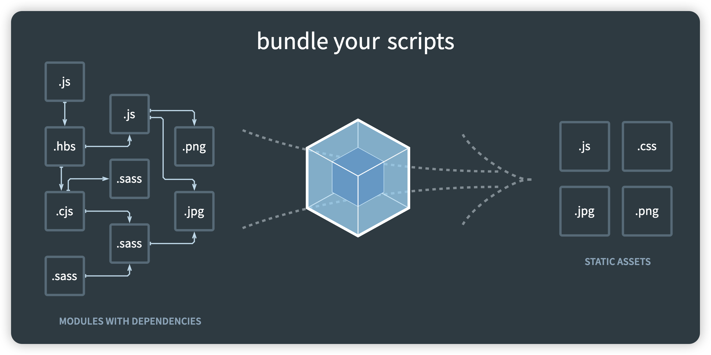

## Webpack是什么

`Webpack` 是一种用于构建 `JavaScript` 应用程序的静态模块打包器，它能够以一种相对一致且开放的处理方式，加载应用中的所有资源文件（图片、CSS、视频、字体文件等），并将其合并打包成浏览器兼容的 `Web` 资源文件。

## Webpack有什么用

在日常工作中，`Webpack` 可以为前端开发者带来以下好处：

- 提高开发效率：通过热重载（HMR）、持久缓存等功能快速响应代码变更。
- 提升性能：通过代码分割、压缩、tree shaking 等优化手段让应用程序加载更快，运行更流畅。
- 维护便利：强大的插件系统和灵活的配置能力可以应对复杂的构建场景和需求变化。
- 兼容性和稳定性：紧跟技术发展潮流，提供对最新技术和标准的良好支持。

## 怎么更好的学习Webpack

学习`Webpack`是一项很值得投入时间和精力的事情，这为后面我们学习和使用各种脚手架，比如`@vue/cli`、`create-react-app`时，打下基础。

`Webpack`不是一个单纯的理论知识，因此需要不断的上手来巩固知识。