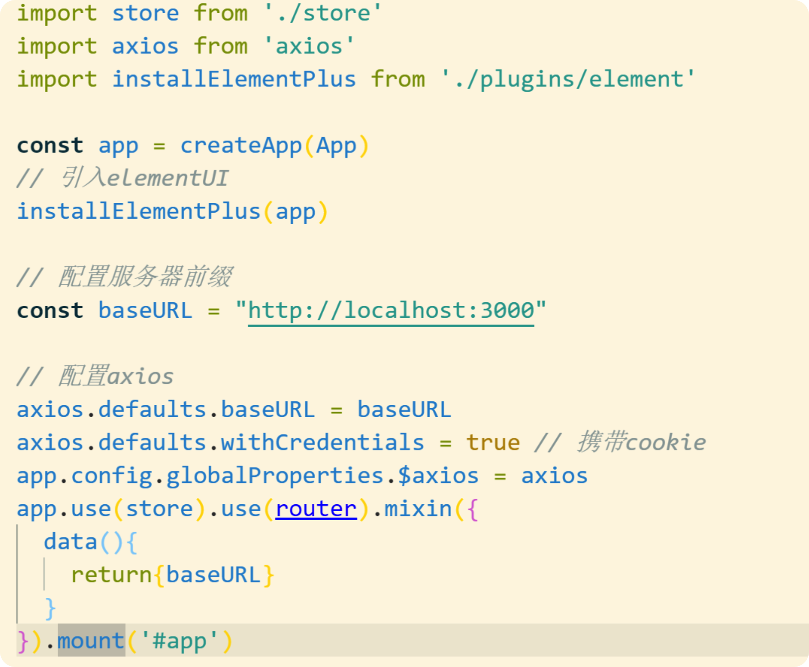

## Options API

### Vue3 创建实例

```html
// vue3通过Proxy代理对象实现的数据的双向绑定 //
vue2通过Object.defineproperty实现数据的双向绑定

<div id="app"></div>
<script>
  Vue.createApp({
     // 存放数据
     data(){
       return{
         name:"新新小朋友",
         age:20
       }
     },
     // 存放方法
     methods:{
       ageAdd(){
         this.age++
       }
     },
     // 存放计算属性 (默认只读不改)
     compouted:{
       show(){
         return `我是${this.name},今年${age}岁`
       }
     },
     // 可以为某一个属性做监听事件，比如用户登录信息发生改变时
     watch：{
       age(){
     		console.log("age发生了变化")
   		}
   	 },
      // 实例被挂载后调用
      mounted(){

     },
       // 数据加载后调用
      create(){

      }
   }).mount("#app")
</script>
```

### 指令

```js
// v-on 可以简写为 @

// $event 事件对象
<button @click="btn($event)"></button>
methods:{
  btn(e){
    console.log(e) //事件对象
  }
}
```

### 组件

```js
// 创建实例
const app = Vue.createApp({})

// 创建组件
app.componet("xinxin",{
  data(){
    return{
      num:0
    }
  },
  methods:{
    add(){
      this.num++
    }
  },
  // 方法
  template:`
		<h3>这是我创建的第一个组件</h3>
		<button>点击按钮</button>
		当前的数字为：<h3>{{num}}</h3>
	`
})

// 挂载
app.mount("#app")


// 使用组件
<html>
	<xinxin><xinxin>
</html>

// 注意： 子组件的模板不可以使用父组件的数据，父组件的模板也不可以子组件的数据

```

### 生命周期

```js
// 写在声明周
期里面的函数 在页面加载的时候，会自动调用一次，常用来操作dom
mounted(){
  // 在页面刷新的时候，自动调用fn一次
  this.fn()

}，
// 当数据改变的时候触发
watch:{
  num(){
    // 监听数据的变量
  },
  // 比如制作面包屑 监听$route
  $route(){
    console.log("理由发生了变化")
  }
}
created(){

}
```

### computed 计算属性传参

```js
// 计算属性传参
<h1>{{sum(10)}}</h1>

computed:{
  sum(){
    return function(i){
      return this.num1+this.num2+i
    }
  }
}
```

### 自动打开 vue 项目

```js
// 在package.json 同级目录下创建一个 vue.config.js

//在里面输入
module.exports = {
  devServer:{
    open:true
  }
  // 或者
  devServer: {
    open: true,
    host: 'localhost'
  }
}


```

### 脚手架搭建项目

```js
// 安装脚手架
npm i @vue/cli -g

// 检测安装的脚手架版本
vue -V

// 创建vue项目 不要使用中文命名
vue create 项目名称

// 选择最后一个选项

// 按空格选择是否选择
(*)  Choose Vue version  // 安装vue
(*)  Babel   // js打包 将高版本打包成浏览器兼容的低版本
()   TypeScript  //js的超集
()   Progressive Web App (PWA) Support   // 将当前网页添加到桌面图标
(*)    Router  // 路由
(*)    Vuex    // vue的数据管理工具
(*)    CSS Pre-processors  //CSS预处理工具 less/sass
()    Linter / Formatter // 必须按照格式书写 检测工具
()    Unit Testing  // 单元测试
()    E2E Testing   // E2E测试

// 然后选择3.x版本 ，选择熟悉的CSS预处理工具， 下一步为是否保存以上配置，碰见是否使用哈希模式 选择是 以供下次快速初始化，接下来开始安装

// 在Appstyle中引入资源中的css文件
@import "assets/css/reset.css"; // 注意带上分号 不然报错

// @ 相当于src目录+

// 在Appstyle中引入img


// 在父组件中引入子组件
import HeaderCom from "@/components/HeaderCom"

```

### vite 搭建项目

```js
// 创建项目
npm init vite@latest

// 进入目录安装依赖
npm install

// 运行
npm run dev

// 安装vue-router
npm add vue-router@next
// 然后创建 router/index.js 文件 引入下面内容
router.js
// 改变main.js 内容
import router from './router'
createApp(App).use(router).mount('#app')

// 安装vuex
npm add vuex@next
// 然后创建 store/index.js 文件 引入下面内容
vuex.js
// 改变main.js 内容
import store from "./store"
createApp(App).use(router).use(store).mount('#app')

// 安装 Less
npm i less -D


// 安装element-plus
// vue add element-plus
npm install element-plus --save
// 改变main.js 内容
const app = createApp(App)
import ElementPlus from 'element-plus'
import 'element-plus/dist/index.css'
app.use(ElementPlus)
// 使用
import { ElMessageBox,ElMessage  } from 'element-plus'
const submit = ()=>{
  ElMessage.success("这是一条提示")
}

// 安装typeScript
vue add @vue/typescript
```

### 组件之间值传递(props)

```js
// 在子组件中 引用父组件的值

// 父组件中：
// 引入子组件
<ChildrenCom :num="num" :abc="abc"></ChildrenCom>

import ChildrenCom from "@/components/ChildrenCom";
export default {
  name: 'App',
  components:{
    ChildrenCom
  },
 	data(){
    return{
      num:20，
      abc:"abc"
    }
  }
}

// 子组件中：
<h4>{{num}}</h4>
<h4>{{abc}}</h4>
export default {
  name: 'ChildrenCom',
  // 用来接受父组件传的值
  props:["num","abc"] // 数组形式接受
  // 接受数据并验证 （推荐写法）
  props:{
    // 指定类型为number
    num:Number,
    // 指定类型为Boolean或String
    abc:[String,Boolean],
    // 必须传值 不能为空
    lei:{
      type:Number,
      required:true
    },
    // 默认配置
    sex:{
      type:String,
      default:"男"
    }
  }
}

// 当父组件传过来的值与子组件重名时，子组件会优先使用自己的变量值，并且与父组件传递的值不再是动态双向绑定
// 单向数据流：对于父级传递的数据，只能用不能改
```

### 触发子组件事件（emit）

```js
// 父组件：
// 调用子组件
<children @myclick="fn"></children>

export default{
  methods:{
    fn(){
      console.log("子组件按钮被调用了")
    }
  }
}

// 子组件
<template>
	这是子组件
	<button @click="fn">子组件按纽</button>
</template>
export default {
	emits:["myclick"]
  methods:{
    fn(){
      this.$emit("myclick")
    }
  }
}
```

### router 路由

```js
// 在router文件下的index.js中配置入口文件，如果使用improt引入路由，代表是直接加载，一般常用于网站打开时的初始页面，采用箭头函数引入的属于懒加载引入，一般引入其他页面，这样可以更快的打开网站

// 跳转方式 会自动转化为a标签
<router-link to="/index"></router-link>
// 利用在router文件下的index.js中路由设置的name来访问
<router-link :to={name:"Index"}></router-link>


// 我们可以添加active-class来设置路由选中后的样式


// 动态路由 设置 假设从article页面访问到articleID页面
{
    path: '/article/:id',
    name: 'ArticleID',
    component: () => import(/* webpackChunkName: "message" */ '../views/ArticleID')
}

// 动态路由 访问
<router-link to="/article/123"></router-link>
<router-link to="/article/234"></router-link>

// 在动态路由页面里面获取id值
methods:{
  getArticleID(){
    let id = this.$route.params.id
    // .... axios操作
  }
},
created(){
  this.getArticleID()
}


// 子路由  在父路由上配置children即可
{
    path: '/about',
    name: 'about',
    component: () => import(/* webpackChunkName: "about" */ '../views/about.vue'),

    // 配置子路由
    children:[
      {
        path:"me",
        name:"aboutMe",
        component:()=>import("../views/aboutMe")
      },
      {
        path:"gs",
        name:"aboutGs",
        component:()=>import("../views/aboutGs")
      }
    ]
  }
// 别忘了再about页面上加上<router-view />


// 网页跳转
push会留下历史记录 但是replace不会留下历史记录

this.$router.push("/news")
this.$router.replace("/news")
this.$router.go(1)  正数前进 负数后退

 // 路由重定向
 {
   path:"/index",
   redirect:"/"
 }

// 路由别名
{
    path: '/message',
    name: 'message',
    // 别名
    alias:["/mes"],
    component: () => import(/* webpackChunkName: "message" */ '../views/message')
  },


 // 404页面
 {
    // 配置404
    path:"/:name(.*)",
    name:"NotFound",
    component:()=>import("../views/NotFound")
  }
```

### vue-router 的二次封装

1. 在 src 下面新建 common 文件夹 用来放置公共配置文件 比如 vue.config.js 启动文件

   

2. 在下面新建 router.js 文件,然后将 router 文件下面的 index.js 的 routes 的数组全部剪贴到 router.js 文件下，记得改里面的路径,并且导出

   

3. 在 router 下面的 index.js 中进行引用


4. 书写方法

```js
// 获取路由信息方法
let getRoutes = function () {
  // 生成路由详细信息
  createRoute(routers)
  return routers
}

// 自动生成路由
function createRoute(arr) {
  for (let i = 0; i < arr.length; i++) {
    if (!arr[i].component) return
    // 自动生成component
    let componentFun = import(`../../views/${arr[i].component}.vue`)
    arr[i].component = () => componentFun
    // 遍历子路由
    if (arr[i].children && arr[i].children.length > 0) {
      createRoute(arr[i].children)
    }
  }
}

// 导出数组
export default getRoutes()
```

### vuex

```js
// vuex用来实现组件之间数据的使用，使得任意组件都可以来访问的数据  全局的数据 比如 用户的信息


// 存放数据
// 类似于组件中的data
state: {
  name:"新新小朋友",
  pass:123456,
  age:20
},

// 存放数据的变更函数
// 类似于组件的methods
mutations: {
  ageAdd(state,val=1){
    if(typeof val != "number"){
      return state.age ++
    }
    // 数据更变
    state.age += val
  }
},

// 结合state数据，处理一些复杂的表达式，产生新的数据
// 类似于组件中的 computed
getters:{
  showInfo(state){
    return `我是${state.name},今年${state.age}岁`
  }
},

// 这里写异步函数的更变
  actions: {
    asyncAgeAdd({commit}){
      setTimeout(()=>{
        // actions本身不做数据的更变 只是异步的调用mutations
        commit("ageAdd")
      },3000)
    }
  },


// 调用vuex中的state的数据 采用computed
// 使用mapState
import {mapState} from "vuex"

computed:{
  ...mapState(["name","age"])
}
// 组件中使用
<h3>{{name}},{{age}}</h3>
// 另外的写法
<h3>{{$store.state.name}},{{$store.state.age}}</h3>


// 采用mapMutations调用vuex里面的方法
// 采用methods
import { mapMutations } from "vuex"

methods:{
  ...mapMutations(["ageAdd"])
}
// 组件中使用
<button @click="ageAdd">修改年龄</button>


// 采用mapGetters调用getters的数据
import { mapGetters } from "vuex"

computed:{
  ...mapGetters(['showInfo"])
}
// 组件中使用
<h3>{{showInfo}}</h3>


// 调用异步处理函数actions
import { mapActions } from "vuex"

computed:{
  ...mapActions(['ascyncAgeAdd'])
}
// 组件中使用
<button @click="asyncAgeAdd">点击延迟变化</button>


```

### 在 Vue 引用 jQuery

```js
// 安装jQuery
npm i jquery -S  （此处小写）

// 局部使用jQuery
import $ from 'jquery'
 export default {
 ...
 }

// 使用jQuery
mounted(){
	console.log($(".box"))
}
```

### 在 Vue 中引用 ElementUI

```js
// 必须先关掉服务 再进行安装 提前保存App.vue

// 在对应终端输入
vue add element-plus

// 在弹出的选项中
//第一个询问是全部引入还是按需引入 选择全部引入
Fully import
//第二个询问是否重写css样式 选择否
n
//第三个询问使用的语言 选择zh-cn
zh-cn

// 然后脚手架中会多一个plugins的文件夹，然后我们的App.vue被更改了 这时候CTRL+Z 撤回即可

const app = createApp(App)
// 引入elementUI
installElementPlus(app)

// 然后再ElementUI官网引入标签即可使用


// 在vue3+TypeScript中需要在tsconfig.json里的compilerOptions加入"noImplicitAny": false


```

### 全局配置 axios

```js
// 安装axios
npm i axios -S

// 在main.js中配置axios
// 导入axios
const app = createApp(App)
import axios from 'axios'

// 安装完需要重启服务

// 默认像哪个地址发送请求，这样在调用时可以不加前缀
axios.defaults.baseURL = "http://localhost:3000"
axios.defaults.withCredentials = true // 携带cookie
app.config.globalProperties.$axios = axios // 添加到实例中，在页面使用$axios 来使用axios

// 使用axios
methods:{
  submit(){
    this.$axios("/reg",{})
  }
}
```

### Vue 混入选项 配置服务器地址



### 面包屑

```js
// 原生
// 样式： 首页 > 商品 > 商品处理
// 原理：将面包屑封装为一个组件，然后在组件里面进行watch监听$route变化，从而改变面包屑，并且设置只有首页时隐藏面包屑，有其他时显示面包屑

watch:{
    $route(to){
      let navList = to.matched
      // 判断是不是单独首页
      if(navList&&navList.length===1&&navList[0].name==="Home"){
        // 隐藏面包屑
        return  this.shows = false
      }
      // 显示面包屑
      this.shows = true
      // 面包屑数据
      this.navList = [{path:"/",name:"Home",meta:{title:"首页"}},...navList]
    }
  }


// element-plus
```

### vue 引入 md 解析器

```js
// 在public静态资源库中引入web笔记本中的 editor.md

// 然后在index.html中引入下面的代码
<link rel="stylesheet" href="<%= BASE_URL %>editor.md/css/editormd.preview.css" />
  <script src="https://cdn.bootcdn.net/ajax/libs/jquery/3.5.1/jquery.min.js"></script>
  <script src="<%= BASE_URL %>editor.md/editormd.min.js"></script>
  <script src="<%= BASE_URL %>editor.md/lib/marked.min.js"></script>
  <script src="<%= BASE_URL %>editor.md/lib/prettify.min.js"></script>
  <script src="<%= BASE_URL %>editor.md/lib/raphael.min.js"></script>
  <script src="<%= BASE_URL %>editor.md/lib/underscore.min.js"></script>
  <script src="<%= BASE_URL %>editor.md/lib/sequence-diagram.min.js"></script>
  <script src="<%= BASE_URL %>editor.md/lib/flowchart.min.js"></script>
  <script src="<%= BASE_URL %>editor.md/lib/jquery.flowchart.min.js"></script>

// 然后在要使用的页面引入下面代码
 <!-- 文章内容 -->
<article>
  <main id="mdToHTML"></main>
</article>


created(){
   // 加载md
    let res = await this.$axios.get(`${data.data.md}`) // md所在位置
    editormd.markdownToHTML("mdToHTML", {
      markdown: res.data,
      emoji: true
    });
}

// 注意：后端的入口文件里的处理静态资源目录写在跨域cros中间件后面
```

### 利用 vuex 实现异步数据的更新

```js
// 场景： 比如我们在同一个组件内切换不同的UI中的table时（每个table里面的内容单独是一个组件），页面没有引起刷新时，想要数据的变化 比如 博客中添加友联 购物车添加等  因此我们可以使用vuex来实现数据的即时更新

// 原理： 在我们添加了一条数据的后，由于UI的性能优化，它不会主动去刷新数据，而是使用缓存，因此我们在添加数据的时候 需要 利用 异步的 `actions`调用`mutations` 去更新一下数据，然后在其他的数据里面引用即可，


// 定义

state: {
  linkList:[]   // 友联数据
},
mutations:{
   // 更新友链数据
    updataLinkList(state,linkList){
      state.linkList = linkList
    }
},
actions:{
  // 异步更新数据  由于actions没有this 因此我们可以传入vm来代替
     getLinkUpdata({commit},vm){
      ((async function(){
        let {data} = await this.$axios.get("/admin/get/link")
        if(data.code){
          return this.$message.warning(data.mes)
        }
        // 触发更新友联 更新数据
        commit('updataLinkList',data.data)
      }).bind(vm))() // bind绑定vm 赋值this
    }
}


// 使用
// 在添加组件内使用
import {mapActions} from "vuex"

methods:{
  ...mapActions(["getLinkUpdata"]),
  async addLink(){
    // ... 添加完数据之后
    // 更新vuex数据 传入this
    this.getLinkUpdata(this)
  }
}

// 在数据展示组件内使用
import {mapActions} from "vuex"
methods:{
  ...mapActions(['getLinkUpdata'])
}
created(){
  // 获取更新后的数据
  this.getLinkUpdata(this)
}


```

### vue 实现懒加载

```js
// 利用UI组件，每当滚动条滚动到底部的时候 想后端发送一次ajxa请求，每次发送的时候，需要发送初始值，发送获取的数量。

// 前端
data(){
  return{
    lazyArticleData:[], // 懒加载获取的文章
    ship:0,   // 加载的序号,也就是从哪个开始，跳过几个
    limit:5,    // 每次加载的个数
  }
},
methods:{
  // 懒加载获取文章
  let {data} = await this.$axios.get("/article",{
    params:{
      skip:this.ship,
      limit:this.limit
    }
  })
  // 切记 这里要在获取之后再加 这样可以从0获取
  this.skip = this.limit+this.skip

}

// 后端
router.get("/article",async(req,res)=>{
  let {skip,limit} = req.query
  // 这里需要数字转化 *1即可
  let doc = await articleDB.find({},{},{
    skip:skip*1,    // 从第几个开始
    limit:ship*1,   // 截取的长度
    sort:{date:-1}  // 文章按照新发表的在上
  })
  if(!doc.length){
   // 没有文章时
    return res.send({
      code:14,
      mes:"文章已全部加载完成"
    })
  }
  res.send({
    code:0,
    mes:"懒加载获取文章列表",
    data:doc
  })
})
```

### vue 引入**Animate.css**

```js
// 安装
npm i animate.css -S

// 在main.js中引入
import animated from "animate.css"
Vue.use(aniamted)


// 使用
// 在对应元素的类名中直接引入 即可
.left{
  //animate__lightSpeedInRight 把前面的animate__删除
  animation: lightSpeedInRight;
  animation-duration: 1s;
}
```

### vue 引入 echarts 图表

```js
// 安装
npm i echarts -S

// 在需要的页面引入
import * as echarts from 'echarts'

// 然后在页面上创建一个容器
<div  id="myChart"
:style="{ width: '100%', height: '300px' }"></div>

// 定义
methods:{
  // 图表
  chartOne(){
    // 获取容器
    let myChart = echarts.init(document.getElementById("myChart"))
    // 绘制图表
    myChart.setOption({
      title: { text: "总用户量" },
      tooltip: {},
      xAxis: {
        data: ["12-3", "12-4", "12-5", "12-6", "12-7", "12-8"],
      },
      yAxis: {},
      series: [
        {
          name: "用户量",
          type: "line",
          data: [5, 20, 36, 10, 10, 20],
        },
      ],
    })
  }
}

// 使用
mounted(){
  // 使用图表
  this.chartOne()
}

```

### vue 页面中加载网站二维码

```js
// 安装qrcodejs2
npm i qrcodejs2 -S

// 需要的页面引入
import QRCode from "qrcodejs2"

<!-- 二维码 -->
<div id="qrcode"></div>

methods:{
  // 生成页面链接
  qrcode(){
    let qrcode = new QRCode('qrcode', { // eslint-disable-line no-unused-vars
      width: 70,
      height: 70,        // 高度
      text:  this.shareLink,   // 二维码内容
      // render: 'canvas' ,   // 设置渲染方式（有两种方式 table和canvas，默认是canvas）
      background: '#fff',   // 背景色
      foreground: '#ff0'    // 前景色
    })
    },
}

mounted() {
  // 加载二维码
  this.$nextTick (function () {
    this.qrcode();
  })
}
```

### vue 实现搜索功能 模糊匹配

```js
// 原理
// 在搜索框中利用v-model绑定一个数据text，然后将数据列表渲染的数据 更改为一个计算属性，然后在计算属性中利用text的动态变化，利用filter和includes进行动态更改。

<!-- template -->
<input class="form-control" type="text" placeholder="请输入查询内容" v-model="text" />
 // 数据渲染
 <tr v-for="(item,index) in serchText" :key="item.id"></tr>

<!--script -->
data(){
  return{
    listData:[], // 请求的数据
    text:"" //搜索框数据
  }
},
computed:{
  serchText(){
    if(!this.text) return this.listData
    return this.listData.filter(item=>{
      return item.name.includes(this.text)
    })
  }
}
```

### vue 引入数字滚动插件

```js
// 安装
npm i vue-count-to -S
```

### 下载文件到本地

```js
 // 下载合同
async download(){
  let {data} = await this.$axios.post("/contract/download")
  if(data.code) return this.$message.wraning(data.mes)
  this.$notify({  //通知框
    title: '下载合同',
    message: '下载合同成功',
    type:'success',
    duration: 2000
  });
  var _url = this.baseURL+data.data.url;
  this.downloadFile(_url);
  // console.log(_url)
},
  downloadFile(url){
    var xhr = new XMLHttpRequest();
    xhr.open('get',url);
    xhr.responseType="blob"; //字节流
    xhr.onload = ()=>{
      if(xhr.status==200){
        console.log(xhr.response);
        var filename = xhr.responseURL.substring(xhr.responseURL.lastIndexOf("/")+1);
        this.saveAs(filename,xhr.response)
      }
    };
    xhr.send();
  },
    saveAs(name, data) {
      var urlObject = window.URL;  //window对象的URL对象是专门用来将blob或者file读取成一个url的。
      var export_blob = new Blob([data]); //代表二进制类型的大对象,Blob对象是二进制数据
      // <a href="12345.jpg" download="名称" >
      var save_link = document.createElement('a');//创建a标签
      save_link.href = urlObject.createObjectURL(export_blob); //通过URL.createObjectURL(blob)可以获取当前文件的一个内存URL
      //download是 HTML5 中<a>标签新增的一个属性，此属性会强制触发下载操作，指示浏览器下载 URL 而不是导航到它，并提示用户将其保存为本地文件
      save_link.download = name;
      save_link.click();//触发a标签单击
    }
```

### webSocket 使用

```js
// 统一ws协议
let local = "localhost:5000"
export const baseURL = `ws://${local}`


// webscoket.ts
import { baseURL } from "@/utils/axios"
export const websocket = (handleMessage:any)=>{
  const ws = new WebSocket(baseURL);

  const init = ()=>{
    binEvent()
  }

  function binEvent(){
    ws.addEventListener("open",handleOpen,false)
    ws.addEventListener("cloes",handleCloes,false)
    ws.addEventListener("error",handleError,false)
    ws.addEventListener("message",handleMessage,false)
  }

  function handleOpen(e:any){
    console.log("websocket open",e)
  }

  function handleCloes(e:any){
    console.log("websocket close",e)
  }

  function handleError(e:any){
    console.log("websocket error",e)
  }

  init()

  return ws

}


// vue
import { websocket } from "@/hooks/websocket"

// 接受服务端广播来的消息
const handleMessage = (e:any)=>{
  //  state.messageList.push(JSON.parse(e.data))
  let data = JSON.parse(e.data)
  // 检测是不是当前用户
  if(data.nextID === 2){

  }
}

// websocket实例化对象
const ws = websocket(handleMessage)

// 发送数据
ws.send(JSON.stringify(
  {
    nowID:1,
    nextID:2,
    type:"收藏"
  }
))


// 后端
安装 npm i ws -S

const WebSocket = require("ws")

;((Ws)=>{
  const server = new Ws.Server({port:5000})

  const init = ()=>{
    bindEvent()
  }


  function bindEvent(){
    server.on("open",handleOpen)
    server.on("close",handleClose)
    server.on("error",handleError)
    server.on("connection",handleConnection)
  }

  function handleOpen(){
    console.log("WebSocket Open")
  }

  function handleClose(){
    console.log("WebSocket Close")

  }
  function handleError(){
    console.log("WebSocket Error")

  }
  function handleConnection(ws){
    console.log("webScoket Connection")
    ws.on("message",handleMessage)
  }
  function handleMessage(mes){
    console.log(mes.toString())
    // 将当前服务端获取到的每一个客户端广播出去
    server.clients.forEach((c)=>{
      c.send(mes.toString())
    })
  }

  init()
})(WebSocket);

```

## Composition API

### 祖孙之间进行响应式值传递

```js
// 如果期望响应式的祖辈之间传值，那么利用setup组合式API进行传值

// 传递  响应式传递基本值  响应式传递引用类型值  只读不能修改
improt {provide,ref,reactive,readonly} from "vue"

// 祖组件：
export default{
  setup(){
    // 处理成响应式数据
    let num = ref(10)
    let obj =reactive({name:"obj",age:12})
  	// 提供给后辈
    provide("num",num)
    provide("obj",obj)
    // 返回给自己使用
    return{
      num
    }
   }
}

// 孙组件
<template>
  <h4>这是孙组件</h4>
	<h5>{{num}}</h5>
	<h5>{{obj}}</h5>
</template>


improt {inject} from "vue"

export default{
  name:"Sun",
  setup(){
    // 接受provide提供的数据
    let num = inject("num")
    let obj = inject("obj")
  	// 需要返回才能当成数据使用
    return{
      num,obj
    }
   }
}


```


```js
// 比如配置服务器地址，vue地址默认为8080，而后端端口地址为其他时

// 在main.js
const baseURL = 'http://loaclhost:3000'

// 在app挂载的时候加入maxin选项，里面的所有数据和方法等 在后续创建的所有组件中都可以使用
app.use(store).use(router).mixin({
  data(){
    return{
      baseURL
    }
  },
  methods:{
    fn(){
      ...
    }
  }
})


// 此后在任何组件中 多了一个 baseURL 值
```

### 路由守卫

```js
// 用来处理一些页面的访问 比如用户在未登录的状态下，可能会手动访问修改信息 或者 非管理员进入后台等

// 导入store对象
import store from "./store"

// 用在vue组件中
beforeRouteEnter(to,from,next){
  // 由于这里没有this 因此可以next里面的参数代替
  next(vm=>{  // 这里的vm相当于this
    vm.$router.replace("/")
    vm.$message.warning("请先登录")
  })

  // 进入写文章页 判断是否登录，如果未登录跳转到登录页面，如果已经登录 继续访问
  if(to.path==="create"&&store.state.userInfo._id){
    next()
  }else{
    next("/login")
  }
}


// 用户router路由配置里 配置全局路由
router.beforeEach((to, from,next) => {
  let token = localStorage.getItem("token")
  // 登录状态下权限
  if(token){
    if(to.path === "/login"||to.path==="/reg"||to.path==="/forget"){
      next("/")
    }
  }else{
    // 未登录状态下权限
    next()
  }
  next()
})


// 在vue3+ts中 我们使用onBeforeRouteUpdate进行在vue组件内判断vuex中的用户信息是否存在
import { RouteComponent, useRoute,onBeforeRouteUpdate,RouteLocationNormalized,NavigationGuardNext,useRouter } from 'vue-router'
 // 获取当前登录用户
const adminInfo = computed(()=>store.state.adminInfo as AdminLoginData)

// 判断
onBeforeRouteUpdate((to:RouteLocationNormalized,from:RouteLocationNormalized,next:NavigationGuardNext)=>{
  if(!adminInfo.value._id){
    // 未登录
    next("/admin/login")
  }else{
    // 已登录
    next()
  }
  console.log(to)
  // next()
})


// 详细介绍
https://www.cnblogs.com/hgdzjp/p/10143707.html
```

### 动态模板

```js
// vue中提供了一个动态模板，可以在任何模板中切换，就是用vue中用：is来挂载不同的组件，使用<component></component>来定义

// 场景，需要切换多个模块时使用，比v-if要节省性能

<button @click="flag='testA'">A组件</button>
<button @click="flag='testB'">B组件</button>
<component :is="flag"></component>

import testA from './testA.vue'; //导入
import testB from './testB.vue'; //导入
```

### 组件缓存

```js
// 每次切换新标签的时候，Vue 都创建了一个新的实例。但是我们不想让它切换 还继续保存上一次看的东西，因此可以使用组件缓存  <keep-alive></keep-alive>
<keep-alive>
    <component :is="flag"></component>
</keep-alive>
// 里面可以传入两个参数
include： 只有匹配的才会去缓存
exclude： 除了匹配的不缓存 其他的都缓存
 <keep-alive include="text1"></keep-alive>
 <keep-alive exclude="text1"></keep-alive>
```

### 路由缓存

```js
// router/index.js里面设置
{
    path:"/mes",
    name:"message",
     meta:{
       keepAlive:true // 需要缓存的路由
     }
    component:()=>import("../views/message")
 },

// 带有 <router-view />页面
   // 缓存带有keepAlive的路由
<keep-alive>
	<router-view v-if="$route.meta.keepAlive" />
</keep-alive>
// 其余路由正常加载
<router-view v-if="!$route.meta.keepAlive" />
```

### vue 项目上线处理

```js
// 配置服务器路径修改 因为本地开发和线上版本服务器地址是不一样的
// 根据运行环境决定是生产版本还是线上版本

const baseURL = process.env.NODE_ENV === "development"?"http://localhost:3000":""


// 运行打包命令
npm run build

// 此使会多出一个dist文件夹，然后把里面的所有内容复制到后端的public中，然后直接运行后端 浏览器输入后端的地址 即可看到前端打包后的页面

// 打包之后 如果我们直接从浏览器地址框进行跳转调式，发现会出现一个后端无此路由的页面，这是因为我们现在是基于后端进行调式，所以浏览器输入网址优先后端，这时我们需要做一个改变

// 在serve文件夹下的index.js加入下面代码
// 让路由正常跳回前端路由

const path = require("path")
// 放到最后 意思q的路由都解决不了的话 通过这里解决 然后直接导入到index.html 文件
app.use("*",(req,res)=>{ 					res.sendFile(path.join(__dirname,"./static/index.html"))
})

```
