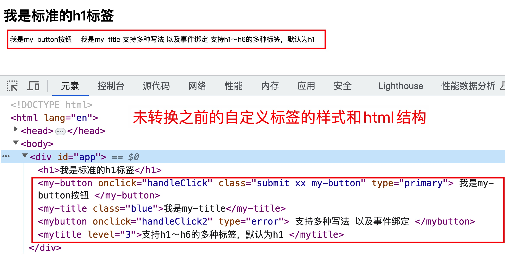
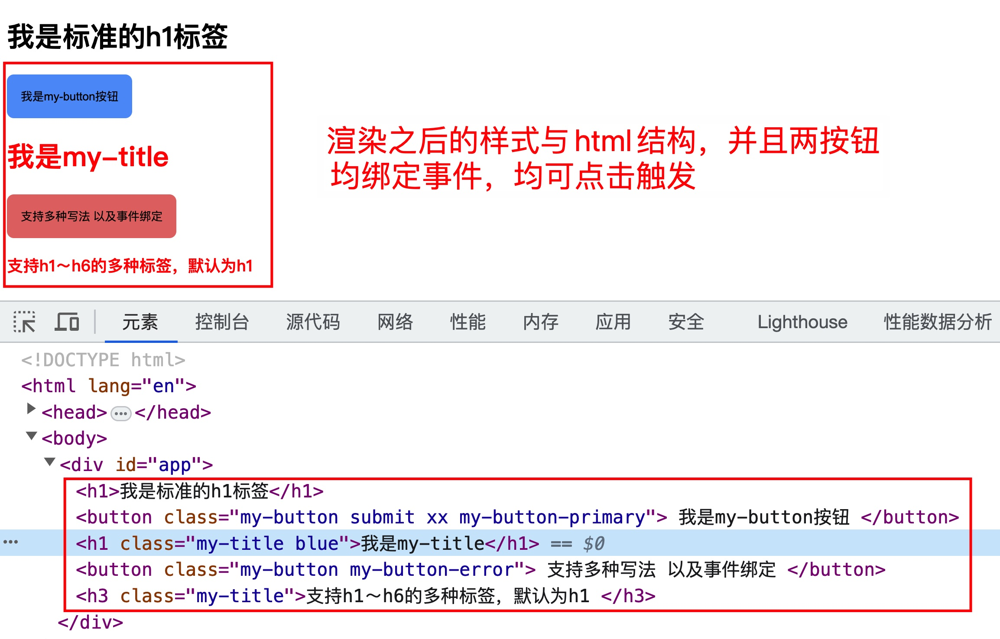
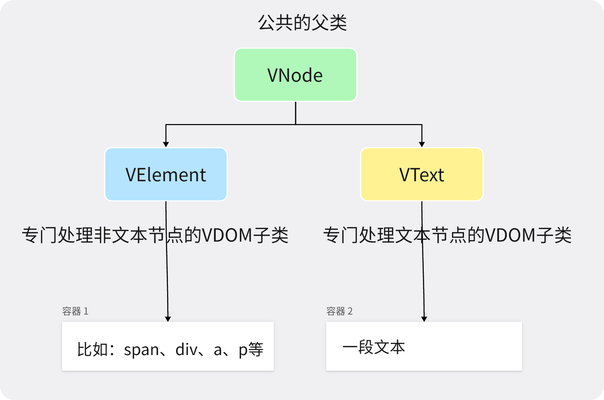

> 本练习对应的 GitHub 仓库： https://github.com/xinxin1228/js-combat-practice

## 渲染自定义 HTML 组件

### 需求描述

- 在`html`模版里直接编写**自定义、非`html`**的标签元素，并且支持多种写法。

  比如`<my-title></my-title>`、`<my-button></my-button>`或`<MyTitle></MyTitle>`、`<MyButton></MyButton>`

- 不影响正常的`html标签元素`的展示

- 能绑定事件，可以处理自定义标签特有的属性，并且支持在自定义标签上写`class`

  `<my-title level='1'></my-title>`中，`level`代表自定义元素的等级，比如默认为`h1`，根绝`level`的值自动生成`h1~h6`之间的标签元素

  `<my-button type='primary' onClick='handleClick'></my-button>`中，`type`指定按钮的状态类型，比如`primary`、`error`等，`onClick`代表给该自定义元素绑定的事件类型

### 准备工作

自定义标签`html`代码

```html
<div id="app">
  <h1>我是标准的h1标签</h1>
  <my-button onclick="handleClick" class="submit xx my-button" type="primary">
    我是my-button按钮
  </my-button>
  <my-title class="blue">我是my-title</my-title>
  <MyButton onclick="handleClick2" type="error">
    支持多种写法 以及事件绑定
  </MyButton>
  <MyTitle level="3">支持h1～h6的多种标签，默认为h1 </MyTitle>
</div>
```

### 效果展示

渲染自定义标签之前的页面样式和控制台的中`html`结构

#### 渲染之前



#### 渲染之后



### 仓库地址

https://github.com/xinxin1228/js-combat-practice/tree/main/%E6%B8%B2%E6%9F%93%E8%87%AA%E5%AE%9A%E4%B9%89%E7%BB%84%E4%BB%B6

## Store 实现多个 class 之间数据共享

### 需求描述

- 封装一个高阶类，可以获取数据和存储数据，提供一下的方法

  ```js
  // 获取存储库中的 [key] 的值
  get(key)

  // 往存储库中存储 [key]: [value]
  set(key, value)

  // 判断是 [key] 是否存在存储库
  has(key)

  // 获取存储库中的所有数据
  show()

  // 删除存储库中的 [key]
  deleteByKey(key)
  ```

- 通过该高阶类，可以做到在多个类中数据进行流通

### 所用的知识

**HOC 高阶类**

1. 在父类使用子类才有的东西
2. 类写完不直接用，而是进行包裹

### 效果展示

```js
import { store } from './Store.js'

const A = stroe.connect(class {...})
const B = store.connect(class {...})

const a = new A()
const b = new B()

console.log(a.get('name')) // undefined
console.log(a.get('name')) // undefined
a.set('name', 'web')
console.log(a.get('name')) // 'web'
console.log(b.get('name')) // 'web'
```

### 仓库地址

https://github.com/xinxin1228/js-combat-practice/tree/main/Store

## 生成虚拟 DOM

### 需求描述

> 现在主流框架，无论是`vue`还是`react`都采用了虚拟 DOM 技术

### 采用虚拟 DOM 的优势

- 简单方便：如果使用手动操作真实 **DOM** 来完成页面，繁琐又容易出错，在大规模应用下维护起来也很困难
- 性能方面：使用**Virtual** **DOM**，能够有效避免真实**DOM** 频繁更新，减少多次引起重绘与回流，提高性能
- 跨平台：React 借助**虚拟 DOM**，带来了跨平台的能力，一套代码多端运行

既然**虚拟 DOM**现在已然是前端的热门话题，而且面试时，时常要求手写出一个真实 DOM 的虚拟 DOM，那么本节的主题就是**手写一个 class 来实现从真实 DOM 抽象为虚拟 DOM**

### 效果展示

#### 真实 DOM

```html
<div id="app">
  <h2 class="my-title">我是h2标签</h2>
  我是一段文本
  <ul class="my-ul">
    <li class="my-li">标签一</li>
    <li class="my-li">标签二</li>
  </ul>
  <button type="button" onclick="alert('hello')">我是一个按钮</button>
</div>
```

#### 虚拟 DOM

> 本效果只展示虚拟 DOM 的应该有的结构和数据，实际生成的虚拟 DOM 可以不完全参考该案例

```js
// 数据结构
{
  type: 'div', // 对应真实DOM的类型，比如diva,ul,li等
  props: {     // 对应真实DOM的attribute属性和自定义属性等
    id: 'app',
    onclick: 'alert("hello")'
  },
  children: []   // 对应真实DOM的子节点，如果是文本，那么该子节点的类型应该是string，并且值就是该文本内容。如果该元素的子节点是其他节点，那么该节点的类型应该是array，内容是对应子节点的vDOM
}


// 比如上面的真实DOM转化之后的vDOM
[
  {
    type: 'div',
    props: {
      id: '#app'
    },
    children: [
      {
        type: 'h2',
        props: { class: 'my-title' },
        children: '我是h2标签'
      },
      {
        type: 'text',
        props: {},
        children: '我是一段文本'
      },
      {
        type: 'ul',
        props: { class: 'my-ul' },
        children: [
          {
            type: 'li',
            props: { class: 'my-li' },
            chilren: '标签一'
          },
          {
            type: 'li',
            props: { class: 'my-li' },
            chilren: '标签二'
          },
        ]
      },
      {
        type: 'button',
        props: {
          type: 'button',
          onclick: 'aleart("hello")'
        },
        children: '我是一个按钮'
      }
    ]
  }
]
```

### 解题思路

#### 一：我们需要几个类来管理 VDOM？

经过我们上面的写的`VDOM`抽象，发现`VDOM`其实主要分为两大类，分别是

- 管理非文本节点类型元素的`VElement`
- 管理文本节点类型的`VText`

为了更好的符合面向对象的逻辑和写法，我们将再**抽象**出一个公共父类——`VNode`。

`VNode`的主要目的是存储渲染之前的`DOM`节点信息，以及处理`VElement`与`VText`公共的**逻辑部分**，尽管目前在本例并没有具体过多的实现，但这依旧是一种很好的面向对象编程思想。

目前的几个类型的关系与说明如下图所示：



#### 二：真实 DOM 转 VDOM 的入口应该是哪个类？

- 首先 VNode 是抽象类，因此它并不能做真实 DOM 的入口来使用
- VText 是专门处理文本类型的 VDOM 类，因此并不适合当作真实 DOM 的入口来使用
- VElement 是处理非文本节点的类，而真实的 DOM 节点（上述案例）是`DIV`节点，因此我们可以使用 VElement 作为入口

### 仓库地址

具体的解法和环境初始化请移步至案例的具体仓库地址：

https://github.com/xinxin1228/js-combat-practice/tree/main/%E7%94%9F%E6%88%90%E8%99%9A%E6%8B%9FDOM

## 封装 Touch 库

### 需求描述

- 封装一个 Touch 事件的相关库，要求可以监听`touchstart`、`touchmove`和`touchsend`事件。

- 并且做到拖出回弹效果，比如当支持`Y轴`方向拖动时，当往下拖拽时最上面出现空白时，松手可自动回弹到最初的位置。
- 用户通过监听实例上面的方法可以进行操作，要求监听的实例方法中，可以返回当前最新的`X轴`与`Y轴`的拖动距离。用户可以进行简单的自定义，比如当下拉时，提示“松手刷新”等字样，并且可以做到**下拉刷新**、**上拉加载**等操作。
- 要求可以满足用户基本配置，比如决定滚动的方向、定义回弹动画时长等。
- 根据自己封装的 Touch 库，实现一个纵向滚动条的上拉加载、下拉刷新、一个弹性拖拽轮播图。具体效果演示看下面的 **效果展示**

### 所用的知识

1. `touch`相关操作的 API
2. 自定义事件队列

### 效果展示


### 仓库地址

具体的解法和环境初始化请移步至案例的具体仓库地址：

https://github.com/xinxin1228/js-combat-practice/tree/main/%E5%B0%81%E8%A3%85Touch%E5%BA%93

## Ajax

### 需求描述

- 文件的上传和下载是每一位前端开发者最基础的技能。
- 往大了说，就是`ajax`请求的数据交互，一般我们在工程化的前端开发模式下，都是使用`axios`这个库，那么我们如何使用**原生**的`ajax`来实现数据交互呢？
- 对于大型文件的上传和下载，我们会使用`loading`效果来暂缓用户的焦虑，但是有些时候用户更想清楚的知道上传和下载的进度，这个时候需要我们时刻反馈给用户的进度。

### 所用的知识

- `XMLHttpRequest`

- `fetch`

- `formData`
- 事件队列
- `RESTful API`
- `node`

### 效果展示

![input[file]选择文件并且反显桌面](../image/前端笔记/02.gif)


### 仓库地址

https://github.com/xinxin1228/js-combat-practice/tree/main/Store
