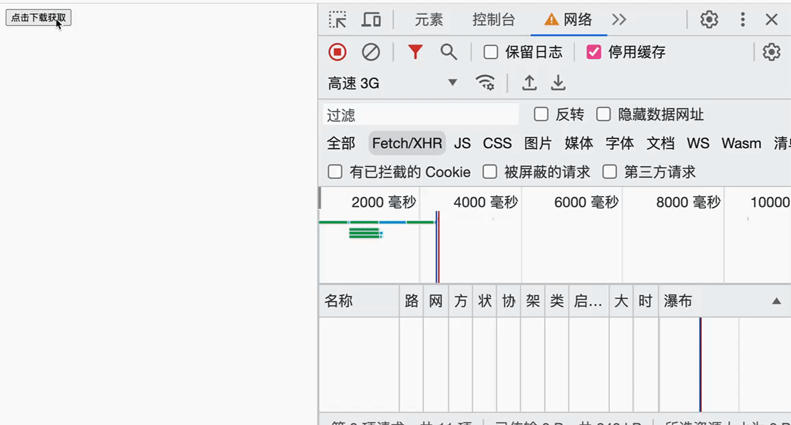

> 本练习对应的 GitHub 仓库： https://github.com/xinxin1228/js-combat-practice

## 渲染自定义 HTML 组件

### 需求描述

- 在`html`模版里直接编写**自定义、非`html`**的标签元素，并且支持多种写法。

  比如`<my-title></my-title>`、`<my-button></my-button>`或`<MyTitle></MyTitle>`、`<MyButton></MyButton>`

- 不影响正常的`html标签元素`的展示

- 能绑定事件，可以处理自定义标签特有的属性，并且支持在自定义标签上写`class`

  `<my-title level='1'></my-title>`中，`level`代表自定义元素的等级，比如默认为`h1`，根绝`level`的值自动生成`h1~h6`之间的标签元素

  `<my-button type='primary' onClick='handleClick'></my-button>`中，`type`指定按钮的状态类型，比如`primary`、`error`等，`onClick`代表给该自定义元素绑定的事件类型

### 准备工作

自定义标签`html`代码

```html
<div id="app">
  <h1>我是标准的h1标签</h1>
  <my-button onclick="handleClick" class="submit xx my-button" type="primary">
    我是my-button按钮
  </my-button>
  <my-title class="blue">我是my-title</my-title>
  <MyButton onclick="handleClick2" type="error">
    支持多种写法 以及事件绑定
  </MyButton>
  <MyTitle level="3">支持h1～h6的多种标签，默认为h1 </MyTitle>
</div>
```

### 效果展示

渲染自定义标签之前的页面样式和控制台的中`html`结构

#### 渲染之前


#### 渲染之后


### 仓库地址

https://github.com/xinxin1228/js-combat-practice/tree/main/%E6%B8%B2%E6%9F%93%E8%87%AA%E5%AE%9A%E4%B9%89%E7%BB%84%E4%BB%B6

## Store 实现多个 class 之间数据共享

### 需求描述

- 封装一个高阶类，可以获取数据和存储数据，提供一下的方法

  ```js
  // 获取存储库中的 [key] 的值
  get(key)

  // 往存储库中存储 [key]: [value]
  set(key, value)

  // 判断是 [key] 是否存在存储库
  has(key)

  // 获取存储库中的所有数据
  show()

  // 删除存储库中的 [key]
  deleteByKey(key)
  ```

- 通过该高阶类，可以做到在多个类中数据进行流通

### 所用的知识

**HOC 高阶类**

1. 在父类使用子类才有的东西
2. 类写完不直接用，而是进行包裹

### 效果展示

```js
import { store } from './Store.js'

const A = stroe.connect(class {...})
const B = store.connect(class {...})

const a = new A()
const b = new B()

console.log(a.get('name')) // undefined
console.log(a.get('name')) // undefined
a.set('name', 'web')
console.log(a.get('name')) // 'web'
console.log(b.get('name')) // 'web'
```

### 仓库地址

https://github.com/xinxin1228/js-combat-practice/tree/main/Store

## 生成虚拟 DOM

### 需求描述

> 现在主流框架，无论是`vue`还是`react`都采用了虚拟 DOM 技术

### 采用虚拟 DOM 的优势

- 简单方便：如果使用手动操作真实 **DOM** 来完成页面，繁琐又容易出错，在大规模应用下维护起来也很困难
- 性能方面：使用**Virtual** **DOM**，能够有效避免真实**DOM** 频繁更新，减少多次引起重绘与回流，提高性能
- 跨平台：React 借助**虚拟 DOM**，带来了跨平台的能力，一套代码多端运行

既然**虚拟 DOM**现在已然是前端的热门话题，而且面试时，时常要求手写出一个真实 DOM 的虚拟 DOM，那么本节的主题就是**手写一个 class 来实现从真实 DOM 抽象为虚拟 DOM**

### 效果展示

#### 真实 DOM

```html
<div id="app">
  <h2 class="my-title">我是h2标签</h2>
  我是一段文本
  <ul class="my-ul">
    <li class="my-li">标签一</li>
    <li class="my-li">标签二</li>
  </ul>
  <button type="button" onclick="alert('hello')">我是一个按钮</button>
</div>
```

#### 虚拟 DOM

> 本效果只展示虚拟 DOM 的应该有的结构和数据，实际生成的虚拟 DOM 可以不完全参考该案例

```js
// 数据结构
{
  type: 'div', // 对应真实DOM的类型，比如diva,ul,li等
  props: {     // 对应真实DOM的attribute属性和自定义属性等
    id: 'app',
    onclick: 'alert("hello")'
  },
  children: []   // 对应真实DOM的子节点，如果是文本，那么该子节点的类型应该是string，并且值就是该文本内容。如果该元素的子节点是其他节点，那么该节点的类型应该是array，内容是对应子节点的vDOM
}


// 比如上面的真实DOM转化之后的vDOM
[
  {
    type: 'div',
    props: {
      id: '#app'
    },
    children: [
      {
        type: 'h2',
        props: { class: 'my-title' },
        children: '我是h2标签'
      },
      {
        type: 'text',
        props: {},
        children: '我是一段文本'
      },
      {
        type: 'ul',
        props: { class: 'my-ul' },
        children: [
          {
            type: 'li',
            props: { class: 'my-li' },
            chilren: '标签一'
          },
          {
            type: 'li',
            props: { class: 'my-li' },
            chilren: '标签二'
          },
        ]
      },
      {
        type: 'button',
        props: {
          type: 'button',
          onclick: 'aleart("hello")'
        },
        children: '我是一个按钮'
      }
    ]
  }
]
```

### 解题思路

#### 一：我们需要几个类来管理 VDOM？

经过我们上面的写的`VDOM`抽象，发现`VDOM`其实主要分为两大类，分别是

- 管理非文本节点类型元素的`VElement`
- 管理文本节点类型的`VText`

为了更好的符合面向对象的逻辑和写法，我们将再**抽象**出一个公共父类——`VNode`。

`VNode`的主要目的是存储渲染之前的`DOM`节点信息，以及处理`VElement`与`VText`公共的**逻辑部分**，尽管目前在本例并没有具体过多的实现，但这依旧是一种很好的面向对象编程思想。

目前的几个类型的关系与说明如下图所示：


#### 二：真实 DOM 转 VDOM 的入口应该是哪个类？

- 首先 VNode 是抽象类，因此它并不能做真实 DOM 的入口来使用
- VText 是专门处理文本类型的 VDOM 类，因此并不适合当作真实 DOM 的入口来使用
- VElement 是处理非文本节点的类，而真实的 DOM 节点（上述案例）是`DIV`节点，因此我们可以使用 VElement 作为入口

### 仓库地址

具体的解法和环境初始化请移步至案例的具体仓库地址：

https://github.com/xinxin1228/js-combat-practice/tree/main/%E7%94%9F%E6%88%90%E8%99%9A%E6%8B%9FDOM

## 封装 Touch 库

### 需求描述

- 封装一个 Touch 事件的相关库，要求可以监听`touchstart`、`touchmove`和`touchsend`事件。

- 并且做到拖出回弹效果，比如当支持`Y轴`方向拖动时，当往下拖拽时最上面出现空白时，松手可自动回弹到最初的位置。
- 用户通过监听实例上面的方法可以进行操作，要求监听的实例方法中，可以返回当前最新的`X轴`与`Y轴`的拖动距离。用户可以进行简单的自定义，比如当下拉时，提示“松手刷新”等字样，并且可以做到**下拉刷新**、**上拉加载**等操作。
- 要求可以满足用户基本配置，比如决定滚动的方向、定义回弹动画时长等。
- 根据自己封装的 Touch 库，实现一个纵向滚动条的上拉加载、下拉刷新、一个弹性拖拽轮播图。具体效果演示看下面的 **效果展示**

### 所用的知识

1. `touch`相关操作的 API
2. 自定义事件队列

### 效果展示


### 仓库地址

具体的解法和环境初始化请移步至案例的具体仓库地址：

https://github.com/xinxin1228/js-combat-practice/tree/main/%E5%B0%81%E8%A3%85Touch%E5%BA%93

## Ajax

### 需求描述

- 文件的上传和下载是每一位前端开发者最基础的技能。
- 往大了说，就是`ajax`请求的数据交互，一般我们在工程化的前端开发模式下，都是使用`axios`这个库，那么我们如何使用**原生**的`ajax`来实现数据交互呢？
- 对于大型文件的上传和下载，我们会使用`loading`效果来暂缓用户的焦虑，但是有些时候用户更想清楚的知道上传和下载的进度，这个时候需要我们时刻反馈给用户的进度。

### 所用的知识

- `XMLHttpRequest`

- `fetch`

- `formData`
- 事件队列
- `RESTful API`
- `node`

### 效果展示

![input[file]选择文件并且反显桌面](../image/前端笔记/02.gif)





### 仓库地址

具体的解法和环境初始化请移步至案例的具体仓库地址：

https://github.com/xinxin1228/js-combat-practice/tree/main/Store

## 手写类似pubsub-js的事件队列库

### 需求描述：

事件队列的作用和用途在这里不再赘述，本案例的目标是在于手写一个类似于`pubsub-js`这样的事件队列库，实现该库中的以下方法：

- `subscribe` 订阅
- `publish` 发布
- `unsubscribe`取消订阅
- `clearAllSubscriptions` 清除所有的订阅
- `getSubscriptions` 获取订阅
- `countSubscriptions` 统计订阅
- 错误处理

实现事件队列库后，分别在`vue`、`react`中引用该库，实现**兄弟组件通信**和**跨级组件通信**，组件之间的关系架构图如下：


要求如下：

- `App`是根组件，在`App`组件中，引入`子组件1`和`子组件2`。
- 在`App`组件中，包含了数据 `count`、`mes`以及方法`addCount`。其中`count`数据类型为`Number`，通过`addCount`方法可以改变`count`的值。
- 在`子组件1`中，包含了自身的数据`a`、`b`以及方法`addA`和`addB`，分别用来改变`a`和`b`的值。并且引用了`App`中的数据`a`和方法`addCount`。
- 在`子组件2`中，要求可以通过点击按钮调用子组件1的`addA`和`addB`方法。并且在`子组件2`中，引入`子组件3`。
- 在`子组件3`中，要求可以通过点击按钮调用子组件1的`addA`和`addB`方法。

### 所用的知识

- vue
- react
- typescript

### 效果展示


### 仓库地址

具体的解法和环境初始化请移步至案例的具体仓库地址：

https://github.com/xinxin1228/js-combat-practice/tree/main/%E6%89%8B%E5%86%99%E7%B1%BB%E4%BC%BCpubsub-js%E7%9A%84%E4%BA%8B%E4%BB%B6%E9%98%9F%E5%88%97%E5%BA%93

## 手写Axios

### 所用的知识

- webpack 

- XMLHttpRequest

- axios使用

- Proxy

- Promise

### 实现的功能

- 发送请求 （`GET`、`POST`、`PUT`、`DELETE`）
- 可多种方式调用传参（`axios[method](url[,data[,config]])`）
- 自定义配置（`{baseURL, transformRequest...}`）
- 进度监控（`{onDownProgress, onUploadProgress}`）
- 拦截器（`axios.interceptors.[request,response].use`）

### 步骤详解

#### 一、编写类文件`Axios`

由于`axios`在调用时，既可以`axios()`调用，可以`axios[method]()`调用，因此这里我使用`proxy`来实现该功能。

```js
class Axios {
	constructor() {
    return new Proxy(this.request, {
      // 这一步是为了 axios() 的时候，调用this.request方法
      apply: (fn, _, argArray) => {
        return fn.apply(this, argArray)
      },
      // 这一步是为了 axios.get() 的时候，调用this.get方法
      get: (_, propName) => {
        return this[propName]
      },
      // 这一步的目的是为了给axios实例赋值，比如axios.defaults = ...
      set: (_, propName, newVal) => {
        this[propName] = newVal
        return true
      }
    })
  }
  
  // axios() 默认调用使用这个方法，axios === axios.request
  request() {}
  
  get() {}
  post() {}
  put() {}
  delete() {}
  
  create() {
    const axios = new Axios()
    
    // 默认
   	axios.defaults = { ... }
    
    return axios
  }
}

// 这一步的目的是将 axios实例上的create方法复制给Axios的静态方法上，这样方便用户可以 Axios.create() 或 axios.create() 创建一个新的axios实例
Axios.create = Axios.prototype.create

export default Axios.create()
```

到了这一步，我们可以引入我们写的文件并且调用axios，比如

```js
import axios from './axios'

axios()

axios.get()

axios.post()

axios.put()

axios.delete()

// 创建新的axios实例
axios.create()

axios.defaults.baseURL = 'http://localhost:3000'
```

#### 二、编写默认配置文件，并且在每次`axios`实例后赋值

```js
// defaultConfig.js
export default {
  baseURL: '', // 请求主地址
  method: 'get', // 请求方式
  headers: {
    common: {
      Accept: 'application/json',
      'Content-Type': 'application/json',
    },
    get: {},
    post: {},
    put: {},
    delete: {}
  },
  // 请求转化，可以用于修改和添加配置信息，优先级高级默认配置，但低于拦截器
  transformRequest(config) {
    return config
  },
  // 响应的数据转化，用于修改 response.data
  transformResponse(data) {
    try {
      return JSON.parse(data)
    } catch {
      return data
    }
  }
}


// axios每次实例后赋值
import defaultConfig from './defaultConfig'

class Axios {
  // ...  同第一步
  
  // config 外面传入的配置
  create(config) {
    const axios = new Axios()
    
    // PS：暂时我们先以简单浅拷贝的形式进行对象之前的合并，但是这种方式有明显的缺点。例如： { a: { name: 'web' } } 和 { a: { age: 22 } }合并时，后者的a会替换前者的a，成为 { a: { age: 22 } }，而并非我们所期望的 { a: { name: 'web', age: 22 } }
    axios.defaults = { ...defaultConfig, ...config }
    
    return axios
  }
}
```

既然发现上面代码中，`利用对象的浅拷贝合并对象的缺点后`，我们来编写一个方法用来对象之间的合并。

编写`utils/mergeConfig.js`

```js
import deepCopy from './deepCopy' // 深拷贝
import { isArray, isTypeToString } from './check' // 类型校验

/**
 * 对象的合并
 * @param {object} target 默认对象
 * @param  {Array<object>} mergeObj 需要合并的对象，合并优先级根据编写顺序，越后的优先级越高.PS: mergeConfig(target, obj1, obj2, obj3)
 * 优先级：obj3 > obj2 > obj1
 * @returns
 */
export default function mergeConfig(target, ...mergeObj) {
  // 处理 单个合并 
  if (mergeObj.length === 1) {
    // 取出第一项 也就是唯一一项
    mergeObj = mergeObj[0]
    // 这里进行深拷贝，防止副作用 篡改传入的对象
    target = deepCopy(target, isArray(target) ? [] : {})
    mergeObj = deepCopy(mergeObj, isArray(mergeObj) ? [] : {})

    for (const key in mergeObj) {
      let oldVal = target[key]
      let newVal = mergeObj[key]

      if (typeof newVal === 'object') {
        // 针对null情况
        if (!newVal) {
          target[key] = newVal
          continue
        }
				
        // 原对象与新对象类型不一致，直接将原对象清空，赋值为新对象的类型
        if (isTypeToString(newVal) !== isTypeToString(oldVal)) {
          oldVal = isArray(newVal) ? [] : {}
        }

        target[key] = mergeConfig(oldVal, newVal)
      } else {
        target[key] = newVal
      }
    }
  } else {
    // 只要mergeObj数组中还有对象，就递归的取出mergeObj的第一项，然后进行合并
    while (mergeObj.length) {
      let obj = mergeObj.shift()

      target = mergeConfig(target, obj)
    }
  }

  return target
}
```

这里就不列出深拷贝以及工具函数的代码，具体可以查看仓库中的完整代码。

那么利用上面的`mergeConfig`，默认赋值的写法可以改为：

```js
create(config) {
  const axios = new Axios()
  
  // 合并配置对象
  axios.default = mergeConfig(defaultConfig, config)
  
  return axios
}
```

#### 三、针对不同的请求方式、传参方式，汇总出一份配置文件

我们先来总结一下不同的`axios`调用方式以及传参方式

`axios`的不同传参方式

- `axios(url)` ： 只传入`url`，默认是`get`请求

- `axios(url, config)`：`url`为请求地址，`config`为请求配置项

- `axios(config)`：`config`为请求配置项

`axios.get`的不同传参方式

- `axios.get(url)`：`url`为请求地址

- `axios.get(url, config)`：`url`为请求地址，`config`为请求配置项

`axios.post`的不同传参方式

- `axios.post(url)`：`url`为请求地址
- `axios.post(url, data)`：`url`为请求地址，`data`为携带的数据
- `axios.post(url, data, config)`：`url`为请求地址，`data`为携带的数据，`config`为请求配置项

`axios.put`的不同传参方式

- `axios.put(url)`：`url`为请求地址
- `axios.put(url, data)`：`url`为请求地址，`data`为携带的数据
- `axios.put(url, data, config)`：`url`为请求地址，`data`为携带的数据，`config`为请求配置项

`axios.delete`的不同传参方式

- `axios.delete(url)`：`url`为请求地址
- `axios.delete(url, config)`：`url`为请求地址，`config`为请求配置项

```js
class Axios {
  // ... 
  
  // 预处理，处理所有请求方式相同的方法
  // 比如 axios[method](url)
  _preprocessing(method, rest) {
    let config = null

    if (rest.length === 1 && isString(rest[0])) {
      config = { url: rest[0], method }
    } else {
      config = undefined
    }

    return config
  }
  
  get(...rest) {
    let config = this._preprocessing('get', rest)
    
    // 但 !config = true 时，说明没有匹配到上面的 预处理 中的参数处理方式
    if (!config) {
      if (rest.length === 2 && isObject(rest[1])) {
        config = { ...rest[1], url: rest[0], method: requestMethod.GET }
      } else {
        throwError(true, '参数不合法')
      }
    }
    
    // 将传入的配置文件整理后传入 统一的合并参数方法中
    return this._mergeConfig(config)
  }
  
  post(...rest) {
    let config = this._preprocessing('post', rest)
    
    if (!config) {
      if (rest.length === 2) {
        throwError(!isString(rest[0]), 'url必须是string类型')
        throwError(
          !isObject(rest[1]) && !isArray(rest[1]),
          'data必须是object类型'
        )

        config = { url: rest[0], data: rest[1], method: requestMethod.POST }
      } else if (rest.length === 3) {
        throwError(!isString(rest[0]), 'url必须是string类型')
        throwError(
          !isObject(rest[1]) && !isArray(rest[1]),
          'data必须是object类型'
        )
        throwError(!isObject(rest[2]), 'config必须是json类型')

        config = {
          ...rest[2],
          url: rest[0],
          data: rest[1],
          method: requestMethod.POST
        }
      } else {
        throwError(true, '参数不合法')
      }
    }
    
    return this._mergeConfig(config)
  }
  
  put(...rest) {
    let config = this._preprocessing(requestMethod.PUT, rest)

    if (!config) {
      if (rest.length === 2) {
        throwError(!isString(rest[0]), 'url必须是string类型')
        throwError(
          !isObject(rest[1]) && !isArray(rest[1]),
          'data必须是object类型'
        )

        config = { url: rest[0], data: rest[1], method: requestMethod.PUT }
      } else if (rest.length === 3) {
        throwError(!isString(rest[0]), 'url必须是string类型')
        throwError(
          !isObject(rest[1]) && !isArray(rest[1]),
          'data必须是object类型'
        )
        throwError(!isObject(rest[2]), 'config必须是json类型')

        config = {
          ...rest[2],
          url: rest[0],
          data: rest[1],
          method: requestMethod.PUT
        }
      } else {
        throwError(true, '参数不合法')
      }
    }

    console.log('put', config)
    return this._mergeConfig(config)
  }

  delete(...rest) {
    let config = this._preprocessing(requestMethod.DELETE, rest)

    if (!config) {
      if (rest.length === 2 && isObject(rest[1])) {
        config = { ...rest[1], url: rest[0], method: requestMethod.DELETE }
      } else {
        throwError(true, '参数不合法')
      }
    }

    console.log('delete', config)
    return this._mergeConfig(config)
  }
  
}
```

我们将不同的请求的参数进行了处理，然后将处理好的参数进行统一处理合并

```js
import urlLib from 'url'

// 合并参数 调用发起请求
  _mergeConfig(config) {
    let { method, url } = config
    let headers = {}

    method = method.toLowerCase()

    // 计算headers
    headers = mergeConfig(
      defaultConfig['headers'],
      defaultConfig['headers']['common'],
      defaultConfig['headers'][method],
      config['headers'],
      config['headers']?.['common'],
      config['headers']?.[method]
    )
    // 删除header无用项
    for (const key in headers) {
      if (['get', 'post', 'put', 'delete', 'common'].includes(key)) {
        const val = headers[key]
        const mergeVal = mergeConfig(
          defaultConfig['headers'][key],
          config['headers']?.[key]
        )

        if (JSON.stringify(val) === JSON.stringify(mergeVal)) {
          delete headers[key]
        }
      }
    }

    // url
    const baseURL = this._getConfigValue(config, 'baseURL', '')

    config.url = urlLib.resolve(baseURL, url)
    config.headers = headers

    conosle.log('config', config)
  }
```

#### 四、发起网络请求

`request.js`

```js
import { isFunction, isObject } from '../utils/check'
import throwError from '../utils/throwError'
import requestMethods from './requestMethods'

// 发送ajax请求
export default function request(config) {
  let { url, method, headers, params, data } = config

  throwError(!url, '请输入url地址')
  throwError(
    !Object.values(requestMethods).includes(method?.toLowerCase()),
    'method不合法'
  )
  throwError(headers && !isObject(headers), 'headers必须是json格式')
  throwError(params && !isObject(params), 'params必须是json格式')

  return new Promise((resolve, reject) => {
    const xhr = new XMLHttpRequest()

    // 挂载params
    // 去除hash
    const searchIndex = url.indexOf('?')
    const hashIndex = url.indexOf('#')

    if (!!~hashIndex) {
      url = url.substring(0, hashIndex)
    }

    if (!~searchIndex) {
      url += '?'
    } else {
      if (url.slice(-1) !== '&') {
        url += '&'
      }
    }

    let searchParams = ''
    for (const key in params) {
      searchParams += `${key}=${params[key]}&`
    }
    if (searchParams.slice(-1) === '&') {
      searchParams = searchParams.slice(0, -1)
    }
    url += searchParams

    xhr.open(method, url)

    // 挂载headers
    for (const key in headers) {
      xhr.setRequestHeader(key, headers[key])
    }

    xhr.send(JSON.stringify(data))

    xhr.addEventListener('load', () => {
      console.log('xhr', xhr)

      if (xhr.status >= 200 && xhr.status < 300) {
        resolve(xhr)
      } else {
        reject(xhr)
      }
    })
    xhr.addEventListener('error', (err) => {
      reject(err)
    })
    xhr.addEventListener('progress', (e) => {
      if (isFunction(config.onDownloadProgress)) {
        config.onDownloadProgress(e)
      }
    })
    xhr.upload.addEventListener('progress', (e) => {
      if (isFunction(config.onUploadProgress)) {
        config.onUploadProgress(e)
      }
    })
  })
}

```

#### 五、处理`transformRequest`和`transformResponese`

```js
_mergeConfig(config) {
    // ... 

    // transformRequest
    this.transformRequest = this._getConfigValue(
      config,
      'transformRequest',
      () => {}
    )
    // transformResponse
    this.transformResponse = this._getConfigValue(
      config,
      'transformResponse',
      () => {}
    )

    if (!this.transformRequest(deepCopy(config)))
      console.warn('transformRequest必须返回config！否则不生效！')

  	// 处理 transformRequest
    config = this.transformRequest(deepCopy(config)) || config

 return new Promise((r, j) => {
    request(config).then(
      (res) => {
        const data = response(res, config)

        if (!_this.transformResponse(data.data))
          console.warn('transformResponse必须返回res！否则不生效！')
				
        // 处理transformResponse
        data.data = _this.transformResponse(data.data)

        r(data)
      },
      (err) => {
        j(err)
      }
    )
  })
}
```

#### 六、拦截器

首先先了解一下`axios`拦截器的用法

##### 请求拦截器

> 注意：请求拦截器的执行顺序是：后添加的先执行，先添加的后执行

```js
// 请求拦截器
axios.interceptors.request.use((config) => {
  console.log('use1')
 	return config
}, (err) => {
  console.log('err')
  return Promise.reject(err)
})

axios.interceptors.request.use((config) => {
  console.log('use2')
 	return config
}, (err) => {
  console.log('err')
  return Promise.reject(err)
})

axios.interceptors.request.use((config) => {
  console.log('use3')
 	return config
}, (err) => {
  console.log('err')
  return Promise.reject(err)
})

// 执行顺序:
use3 => use2 => use1
```

##### 响应拦截器

> 注意：响应拦截器的执行顺序是：先添加的先执行，后添加的后执行

```js
axios.interceptors.response.use((data) => {
  console.log('use11')
}, (err) => {
  console.log(err)
  return Promise.reject(err)
})

axios.interceptors.response.use((data) => {
  console.log('use22')
}, (err) => {
  console.log(err)
  return Promise.reject(err)
})

axios.interceptors.response.use((data) => {
  console.log('use22')
}, (err) => {
  console.log(err)
  return Promise.reject(err)
})

// 执行顺序：
use11 => use22 => use33
```

因为拦截器的调用是**链式调用**的，因此我们可以想到`Promise`的`then`链式调用，下面是使用`Promise`链式调用的案例：

```js
// 合并参数 调用发起请求
_mergeConfig(config) {
 // ...

  // transformRequest
  this.transformRequest = this._getConfigValue(
    config,
    'transformRequest',
    () => {}
  )
  // transformResponse
  this.transformResponse = this._getConfigValue(
    config,
    'transformResponse',
    () => {}
  )

  if (!this.transformRequest(deepCopy(config)))
    console.warn('transformRequest必须返回config！否则不生效！')

  config = this.transformRequest(deepCopy(config)) || config

  // 请求拦截器调用链 [默认的请求发送]
  const requestList = [this.dispatchRequest()]
  this.interceptors.request.forEach((item) => {
    requestList.unshift(item)
  })
  this.interceptors.response.forEach((item) => {
    requestList.push(item)
  })

  let requestPromise = Promise.resolve(config)

  while (requestList.length) {
    const { resolve, reject } = requestList.shift()

    requestPromise = requestPromise.then(resolve, reject)
  }

  return requestPromise
}

// 发起请求
dispatchRequest() {
  let _this = this

  return {
    resolve(config) {
      return new Promise((r, j) => {
        request(config).then(
          (res) => {
            const data = response(res, config)

            if (!_this.transformResponse(data.data))
              console.warn('transformResponse必须返回res！否则不生效！')

            data.data = _this.transformResponse(data.data)

            r(data)
          },
          (err) => {
            j(err)
          }
        )
      })
    },
    reject(err) {
      return Promise.reject(err)
    }
  }
}
```

### 仓库地址

https://github.com/xinxin1228/js-combat-practice/tree/main/%E6%89%8B%E5%86%99axios/webpack-axios
