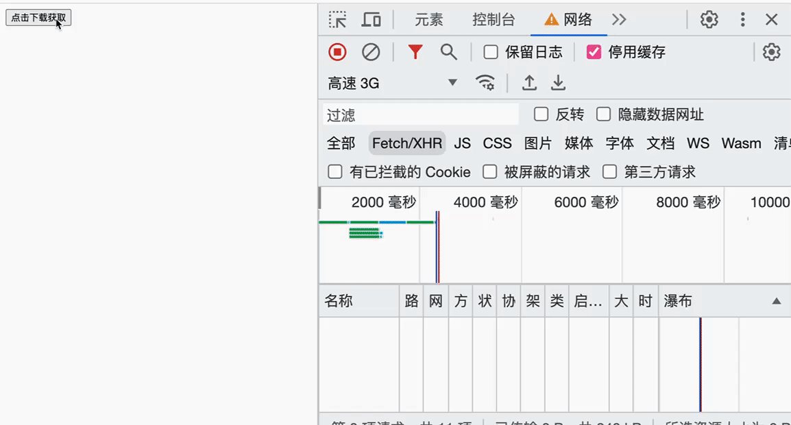

## 需求描述

- 文件的上传和下载是每一位前端开发者最基础的技能。
- 往大了说，就是`ajax`请求的数据交互，一般我们在工程化的前端开发模式下，都是使用`axios`这个库，那么我们如何使用**原生**的`ajax`来实现数据交互呢？
- 对于大型文件的上传和下载，我们会使用`loading`效果来暂缓用户的焦虑，但是有些时候用户更想清楚的知道上传和下载的进度，这个时候需要我们时刻反馈给用户的进度。

## 所用的知识

- `XMLHttpRequest`

- `fetch`

- `formData`
- 事件队列
- `RESTful API`
- `node`

## 效果展示

![input[file]选择文件并且反显桌面](../../image/前端笔记/02.gif)





## 项目搭建

### 项目结构

```shell
# 项目目录说明

├── README.md     # 介绍文件
├── client        # 里面包含了所有的前端案例
├── serve         # 服务端 采用node搭建
│   ├── express  # express版本的接口
│   └── koa      # koa版本的接口
└── 素材          # 案例中所用到的图片文件
```

### 主要代码说明

#### 一、前端事件队列主要代码

```js
class EventQueue {
  constructor() {
    this.queue = new Map()
  }

  $emits(type, ...data) {
    if (!this.queue.has(type) || !this.queue.get(type)?.size) return

    Array.from(this.queue.get(type)).forEach(item => {
      if (typeof item === 'function') {
        item.apply(this, data)
      }
    })
  }

  $on(type, fn) {
    const typeInfo = this.queue.get(type) || new Set()
    typeInfo.add(fn)
    this.queue.set(type, typeInfo)
  }

  $remove(type, fn) {
    if (!this.queue.has(type)) return
    const typeInfo = this.queue.get(type)
    if (!typeInfo.has(fn)) return
    typeInfo.delete(fn)
    this.queue.set(type, typeInfo)
  }

  $clear() {
    this.queue.clear()
  }
}
```

#### 二、前端 xhr 主要代码（已封装）

```js
class Request extends EventQueue {
  constructor() {
    super()

    this._init.get = this.get.bind(this)
    this._init.post = this.post.bind(this)
    this._init.put = this.put.bind(this)
    this._init.delete = this.delete.bind(this)
    this._init.upload = this.upload.bind(this)
    this._init.onProgress = this.onProgress.bind(this)
    this._init.onUploadProgress = this.onUploadProgress.bind(this)

    return this._init
  }

  /**
   *
   * @param {'GET'|"POST"|"PUT"|"DELETE"} methods 请求的方法
   * @param {string} url 请求的地址
   * @param {object} data 请求的参数
   * @returns
   */
  _init(methods, url, data) {
    this.methods = methods
    this.url = url
    this.searchParams = ''
    this.params = {}
    this.formData = new FormData()

    if (data !== undefined && !judgeObject(data))
      throw TypeError('data必修是json类型')

    // 处理参数 GET请求参数全部放在 params 中
    if (data) {
      if (this.methods.toUpperCase() === 'GET') {
        this.params = Reflect.get(data, 'params')
      } else {
        this.params = data
      }
    }

    // 处理GET请求 参数拼接url后面
    if (judgeObject(this.params)) {
      for (const key in this.params) {
        this.searchParams += `${key}=${this.params[key]}&`
      }

      if (this.searchParams.endsWith('&'))
        this.searchParams = this.searchParams.slice(0, -1)

      this.methods.toUpperCase() === 'GET' &&
        (this.url += `?${this.searchParams}`)
    }

    return new Promise((resolve, reject) => {
      const xhr = new XMLHttpRequest()

      xhr.open(this.methods, this.url)
      xhr.setRequestHeader('Content-Type', 'application/json')
      xhr.upload.addEventListener('progress', e => {
        this.$emits('uploadProgress', e.loaded, e.total)
      })
      xhr.addEventListener('progress', e => {
        this.$emits('progress', e.loaded, e.total)
      })
      xhr.send(JSON.stringify(this.params))

      xhr.addEventListener('load', () => {
        try {
          resolve(JSON.parse(xhr.responseText))
        } catch (error) {
          resolve(xhr.responseText)
        }
      })
      xhr.addEventListener('error', () => {
        reject(xhr.responseText)
      })
    })
  }

  get(url, data) {
    return this._init('GET', url, data)
  }

  post(url, data) {
    return this._init('POST', url, data)
  }

  put(url, data) {
    return this._init('PUT', url, data)
  }

  delete(url, data) {
    return this._init('DELETE', url, data)
  }

  /**
   * 上传文件
   * @param {string} url API地址
   * @param {FormData} data 携带的数据
   * @param {number} maxCount 最大上传的文件个数
   * @returns
   */
  upload(url, data, maxCount) {
    if (!(data instanceof FormData)) throw `data 必须是 FormData 类型`
    if (!Array.from(data).length) throw '请选择要上传的文件！'

    maxCount && data.append('maxCount', maxCount)
    return new Promise((resolve, reject) => {
      const xhr = new XMLHttpRequest()
      xhr.open('POST', url)

      xhr.upload.addEventListener('progress', e => {
        this.$emits('uploadProgress', e.loaded, e.total)
      })

      xhr.send(data)

      xhr.addEventListener('load', () => {
        try {
          resolve(JSON.parse(xhr.responseText))
        } catch (error) {
          resolve(xhr.responseText)
        }
      })
      xhr.addEventListener('error', () => {
        reject(xhr.responseText)
      })
    })
  }

  /**
   * 上传进度
   * @param {(loaded, total) => void} callback 回调
   */
  onUploadProgress(callback) {
    this.$on('uploadProgress', callback)
  }
  /**
   * 下载进度
   * @param {(loaded, total) => void} callback 回调
   */
  onProgress(callback) {
    this.$on('progress', callback)
  }
}

/**
 * 检测是否为对象
 * @param {any} rest 检测的目标对象
 * @returns
 */
function judgeObject(res) {
  return !(typeof res !== 'object' || Array.isArray(res) || res === null)
}

const request = new Request()
```

#### 三、前端 fetch 主要代码（已封装）

```js
class Request extends EventQueue {
  constructor() {
    super()

    this._init.get = this.get.bind(this)
    this._init.post = this.post.bind(this)
    this._init.put = this.put.bind(this)
    this._init.delete = this.delete.bind(this)
    this._init.upload = this.upload.bind(this)
    this._init.onProgress = this.onProgress.bind(this)

    return this._init
  }

  _init(methods, url, data) {
    this.methods = methods
    this.url = url
    this.data = data
    this.searchParams = ''

    if (data) {
      if (this.methods.toUpperCase() === 'GET') {
        this.params = Reflect.get(data, 'params')
      } else {
        this.params = data
      }
    }

    if (judgeObject(this.params)) {
      for (const key in this.params) {
        this.searchParams += `${key}=${this.params[key]}&`
      }

      if (this.searchParams.endsWith('&'))
        this.searchParams = this.searchParams.slice(0, -1)

      this.methods.toUpperCase() === 'GET' &&
        (this.url += `?${this.searchParams}`)
    }

    return new Promise(async (resolve, reject) => {
      try {
        const res = await fetch(this.url, {
          method: this.methods,
          headers: {
            'Content-Type': 'application/json',
          },
          body:
            this.methods.toUpperCase() === 'GET'
              ? undefined
              : JSON.stringify(this.params),
        })

        const reader = res.body.getReader()
        // 获得总长度（length）
        const contentLength = +res.headers.get('Content-Length')
        // 读取数据
        let receivedLength = 0 // 当前接收到了这么多字节
        let chunks = [] // 接收到的二进制块的数组（包括 body）
        while (true) {
          const { done, value } = await reader.read()

          if (done) break

          chunks.push(value)
          receivedLength += value.length

          this.$emits('fetch-progress', receivedLength, contentLength)
        }

        // 将块连接到单个 Uint8Array
        let chunksAll = new Uint8Array(receivedLength)
        let position = 0
        for (let chunk of chunks) {
          chunksAll.set(chunk, position)
          position += chunk.length
        }

        // 解码成字符串
        let result = new TextDecoder('utf-8').decode(chunksAll)
        let data = JSON.parse(result)

        resolve(data)
      } catch (error) {
        reject(error)
      }
    })
  }

  get(url, data) {
    return this._init('GET', url, data)
  }
  post(url, data) {
    return this._init('POST', url, data)
  }
  put(url, data) {
    return this._init('PUT', url, data)
  }
  delete(url, data) {
    return this._init('DELETE', url, data)
  }
  upload(url, data, maxCount) {
    if (!(data instanceof FormData)) throw `data 必须是 FormData 类型`
    if (!Array.from(data).length) throw '请选择要上传的文件！'

    data.append('maxCount', maxCount)
    return new Promise(async (resolve, reject) => {
      try {
        const res = await fetch(url, {
          method: 'POST',
          body: data,
        })
        const json = await res.json()
        resolve(json)
      } catch (error) {
        reject(error)
      }
    })
  }
  onProgress(callback) {
    this.$on('fetch-progress', callback)
  }
}

/**
 * 检测是否为对象
 * @param {any} rest 检测的目标对象
 * @returns
 */
function judgeObject(res) {
  return !(typeof res !== 'object' || Array.isArray(res) || res === null)
}

const request = new Request()
```

#### 四、【express】后端上传文件部分主要代码（已封装）

```js
// 位置： src/utils/upload.js

// 具体代码如下：
const { join, extname } = require('path')
const multer = require('multer')
const dayjs = require('dayjs')

/**
 * 上传文件
 * @param {string} path 文件存储路径，相对于public
 * @param {number} maxCount 上传文件的最大数量，为0时表示不限制
 */
const upload = (path = '', maxCount) => {
  return new Promise(resolve => {
    const upload = multer({
      storage: multer.diskStorage({
        // 文件存储的目录
        destination(req, file, cb) {
          maxCount = maxCount === 0 ? 0 : req.body.maxCount || 3
          cb(null, join(__dirname, '../../public/' + path))
        },
        // 文件的名字
        filename(req, file, cb) {
          let name = file.originalname.slice(
            0,
            file.originalname.lastIndexOf('.')
          )
          let ext = extname(file.originalname)
          req.coverFile = dayjs().format('YYYYMMDD') + '_' + name + ext
          cb(null, req.coverFile) //名字
        },
      }),
    })

    if (maxCount) {
      resolve(upload.array('file', maxCount))
    } else {
      resolve(upload.array('file'))
    }
  })
}

module.exports = upload
```

#### 五、【express】使用已封装好的上传文件方法

```js
const experess = require('express')
const upload = require('../../utils/upload')
const router = express.Router()

router.post('/upload', async (req, res) => {
  try {
    const uploadFile = await upload('')

    uploadFile(req, res, err => {
      if (err) return res.send({ code: 4, err })
      if (req.files?.length > req.body.maxCount) {
        return res.send({ code: 4, mes: `最多上传${req.body.maxCount}个文件` })
      }

      res.send({
        code: 0,
        mes: '上传成功！',
        files: req.files,
      })
    })
  } catch {
    res.send({
      code: 5,
      mes: '服务器异常，请稍后再试',
    })
  }
})

module.exports = router
```

#### 六、【koa】后端上传文件部分主要代码（已封装）

```js
// 位置： src/utils/upload.js

// 具体代码如下：
const path = require('path')
const fs = require('fs')
const dayjs = require('dayjs')

const upload = (ctx, url, maxCount) => {
  url = url || ''
  maxCount = maxCount === 0 ? 0 : +ctx.request.body?.maxCount || 0
  const files = ctx.request.files?.file
  // 上传后的文件可访问路径
  let filePaths = []
  let filePath = {}

  if (Array.isArray(files)) {
    if (!files.length) throw '请选择要上传的文件！'
  } else {
    if (!files) throw '请选择要上传的文件！'
  }

  if (Array.isArray(files)) {
    if (maxCount && files.length > maxCount) {
      throw `最多上传${maxCount}张图片`
    }

    // 单次上传多张
    files.forEach((file) => {
      filePaths.push(writeFile(ctx, file, url))
    })
  } else {
    filePath = writeFile(ctx, files, url)
  }

  return { filePath, filePaths }
}

function writeFile(ctx, file, url) {
  const fileName = `${dayjs().format('YYYYMMDD')}_${file.originalFilename}`
  // 存储路径
  const storagePath = path.resolve(__dirname, `../public/${url}`)

  // 文件夹不存在
  if (!fs.existsSync(storagePath)) fs.mkdirSync(storagePath)

  // 存储路径名称 全程
  const filePath = `${storagePath}/${fileName}`

  const reader = fs.createReadStream(file.filepath)
  const upStream = fs.createWriteStream(filePath)
  reader.pipe(upStream)

  return {
    path: `${ctx.protocol}://${ctx.header.host}/${url}/${fileName}`,
    size: file.size,
    name: file.originalFilename
  }
}

module.exports = upload
```

#### 七、【koa】使用已经封装好的上传文件方法

```js
const Router = require('@koa/router')
const router = new Router()

router.post('/upload', async (ctx) => {
  try {
    const { filePath, filePaths } = upload(ctx, '')

    ctx.status = 200
    ctx.body = {
      mes: '上传成功！',
      filePath,
      filePaths
    }
  } catch (error) {
    ctx.status = 500
    ctx.body = error
  }
})

module.exports = router
```


### 前端文件说明

```shell
client
├── 01_使用xhr发送网络请求.html  # 使用xhr发送RESTful API请求
├── 02_使用fetch发送网络请求.html # 使用fetch发送RESTful API请求
├── 03_input[file]选择文件并且反显桌面.html # 结合input[file]选择文件并且反显到桌面
├── 04_使用xhr结合input上传文件.html # 使用xhr结合input上传文件
├── 05_使用fetch结合input上传文件.html # 使用fetch结合input上传文件
├── 06_使用xhr结合form上传文件.html # 使用xhr结合form上传文件
├── 07_使用fetch结合form上传文件.html # 使用fetch结合input上传文件
├── 08_实现上传的进度条xhr版.html # 使用xhr结合进度条上传文件
├── 09_实现下载的进度条xhr版.html # 使用xhr结合进度条下载文件
├── 10_实现下载的进度条fetch版.html # 使用xhr结合进度条下载文件
├── imgs
│   └── 删除.png
└── utils
    ├── request_fetch.js   # 封装的fetch
    ├── EventQueue.js      # 事件队列
    ├── progress.js        # 下载用的进度条
    └── request_xhr.js     # 封装的xhr

```

## 附：使用 `axios` 实现相同的效果

### `axios`实现上传与下载进度

```js
// 上传文件 并且显示上传进度
const uploadUrl = 'http://localhost:3000/api/upload'
const formData = new FormData()

inputEl.addEventlistener('click', e => {
  for (const file of e.files) {
    formData.append('file', file)
  }
})


axios.post(uploadUrl, formData, {
  // 上传进度
  onUploadProgress: e => {
    const progress = ((e.loaded / e.total) * 100).toFixed(2)
    console.log(e.loaded, e.total)
  },
})

axios.get(fileUrl, {
  // 下载进度
  onDownloadProgress: e => {
    const progress = ((e.loaded / e.total) * 100).toFixed(2)
    console.log(e.loaded, e.total)
  },
})
```

## 仓库地址

https://github.com/xinxin1228/js-combat-practice/tree/main/Ajax
