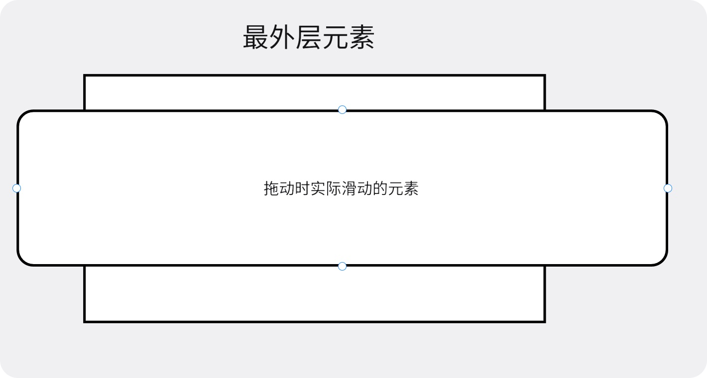

## webpack-js 版

### 需求描述

- 封装一个 Touch 事件的相关库，要求可以监听`touchstart`、`touchmove`和`touchsend`事件。

- 并且做到拖出回弹效果，比如当支持`Y轴`方向拖动时，当往下拖拽时最上面出现空白时，松手可自动回弹到最初的位置。
- 用户通过监听实例上面的方法可以进行操作，要求监听的实例方法中，可以返回当前最新的`X轴`与`Y轴`的拖动距离。用户可以进行简单的自定义，比如当下拉时，提示“松手刷新”等字样，并且可以做到**下拉刷新**、**上拉加载**等操作。
- 要求可以满足用户基本配置，比如决定滚动的方向、定义回弹动画时长等。
- 根据自己封装的 Touch 库，实现一个纵向滚动条的上拉加载、下拉刷新、一个弹性拖拽轮播图。具体效果演示看下面的 **效果展示**

### 所用的知识

1. `touch`相关操作的 API
2. 自定义事件队列

### 效果展示


### 步骤详解

#### 一、先熟悉`Touch`事件

在这里，我们主要关心三个事件，并且是

- `touchStart` 手指触摸屏幕时触发
- `touchMove`手指在屏幕上移动时触发
- `touchEnd`手指在屏幕上抬起时触发

#### 二、封装`MyTouch`类

1. 我们封装一个类，这样在使用的时候，只需要在使用的时候传入要加`touch效果`的元素ID名或class类名即可，并且我们取该元素内部的第一个**子元素**为**实际滑动**的区域，关系如下图所示：



获取元素的代码如下：

```js
class MyTouch {
  constructor(el) {
    this.el = el
    
    _init()
  }
  
  // 根据传入的el获取真实的DOM元素
  _init() {
    // 获取最外层元素
    this.dom = document.querySelector(this.el)
    if (!this.dom) throw new Error(`${this.el} is not exist`) 
    
    // 获取内层实际拖动的元素
    this.children = this.dom.children[0]
    if (!this.children) throw new Error(`${this.el} mush have one child!`)
  }
}
```

2. 获取到了元素之后，我们开始添加`touch`事件，并且考虑到组件可能会被销毁，因此我们要提供事件的取消方法。

```js
class MyTouch {
  _init() {
   // ... 

    this.__touchStart = () => {}
    this.__touchMove = () => {}
    this.__touchEnd = () => {}

    this.dom.addEventListener('touchstart', this.__touchStart)
    this.dom.addEventListener('touchMove', this.__touchMove)
    this.dom.addEventListener('touchstart', this.__touchEnd)
  }
  
  // 取消事件监听
  destroy() {
    this.dom.removeEventListener('touchstart', this.__touchStart)
    this.dom.removeEventListener('touchMove', this.__touchMove)
    this.dom.removeEventListener('touchstart', this.__touchEnd)
  }
}
```

3. 接下来我们重点完善`this.__touch*`中的方法，目的主要是用来获取当前拖拽的位置，并将当前的位置记录于`this.position`，为了函数的简洁，我们将主要的移动变化逻辑进行再次提取，分别提取到`this._start`、`this._move` 和`this._end`中

```js
// 初始化事件
_init() {
  // ...
  
  // 按下瞬间 所在的位置
  let startX = 0
  let startY = 0
  let startPosition // 用来记录上次离开时位置，用来后续的累加

  this.__handleStart = (e) => {
    // 阻止浏览器的默认事件
    e.preventDefault()
    e.stopPropagation()

    startX = e.targetTouches[0].clientX
    startY = e.targetTouches[0].clientY
    startPosition = { ...this.position }

    this._start()
  }
  this.__handleMove = (e) => {
    e.preventDefault()
    e.stopPropagation()

    const moveX = e.targetTouches[0].clientX - startX + startPosition.x
    const moveY = e.targetTouches[0].clientY - startY + startPosition.y

    this.position.x = moveX
    this.position.y = moveY

    this._move()
  }
  this.__handleEnd = () => {
    this._end()
  }
  
  // ...
}

```

4. 完善移动和处理逻辑

```js
class MyTouch {
  // ...
  
  _start() {}
  
  _move() {
    let { x, y } = this.position
    
    // 我们希望当元素拖出去的时候，我们再拖时速度会变得很慢
    if (y > 0) y *= 0.3
    if (x > 0) x *= 0.3

    // 计算出元素可拖动的最大距离
    if (this.children.clientHeight > this.dom.clientHeight) {
      this.maxScrollY = this.dom.clientHeight - this.children.clientHeight
    }
    if (this.children.clientWidth > this.dom.clientWidth) {
      this.maxScrollX = this.dom.clientWidth - this.children.clientWidth
    }

    if (y < this.maxScrollY)
      y = (y - this.maxScrollY) * 0.3 + this.maxScrollY
    if (x < this.maxScrollX)
      x = (x - this.maxScrollX) * 0.3 + this.maxScrollX

    this.container.style.transform = `translate(${x}px, ${y}px)`
  }
  
  _end() {
    let { x, y } = this.position

    // 当元素拖出去的时候，可以回弹
    if (x > 0) x = 0
    if (y > 0) y = 0
    if (x < this.maxScrollX) x = this.maxScrollX
    if (y < this.maxScrollY) y = this.maxScrollY

    this.position.x = x
    this.position.y = y
    this.container.style.transition = `transform 500ms`
    this.container.style.transform = `translate(${x}px, ${y}px)`

    setTimeout(() => {
      this.container.style.transition = ''
    }, 500)
  }
  
  // ...
}
```

目前，我们就做到了最基本的拖拽功能，并且在元素拖到边界后，可以自动回弹，不错，很nice！

但是，我们的配置不够自由，不可以配置拖动的方向（目前是任意方向都可以拖动），比如我只想要横向拖动，并且拖出边界之后的缓冲速度倍率、回弹时间等，都是写死的，那么接下来我们增加**配置项**，让我们的拖拽库更加灵活。

#### 三、添加可配置信息

首先，我们需要一个默认的配置，默认为只可纵向拖动，并且倍率为0.3，回弹时间为300ms

```js
const defaultConfig = {
  scrollX: false,    		// 是否可横向拖动
  scrollY: true,     		// 是否可纵向拖动
  buffer: 0.3,       		// 拖动倍率
  animateDuration: 300  // 回弹时间
}
```

在`constructor`中添加第二个参数，为配置项信息，这样用户在创建实例的时候可以传入对应的配置项

```js
const touch = new Touch('.app', {
  buffer: 0.5,
  animateDuration: 500
})
```

合并用户传入的配置项内容，并且替换默认写死的数据

```js
class MyTouch {
  constructor(el, config = {}) {
    // 合并配置，因为我们这里只有一层，因此直接浅拷贝合并
    this.config = { ...defaultConfig, ...config }
  }
  
  // ...
  
  // 替换写实数据为配置项数据
  _move() {
    let { x, y } = this.position
    const { scrollX, scrollY, buffer } = this.options

    if (y > 0) y *= buffer
    if (x > 0) x *= buffer

    // ...

    if (y < this.maxScrollY)
      y = (y - this.maxScrollY) * buffer + this.maxScrollY
    if (x < this.maxScrollX)
      x = (x - this.maxScrollX) * buffer + this.maxScrollX

    if (scrollX && scrollY) {
      this.container.style.transform = `translate(${x}px, ${y}px)`
    } else if (scrollX) {
      this.container.style.transform = `translateX(${x}px)`
    } else if (scrollY) {
      this.container.style.transform = `translateY(${y}px)`
    }
  }
  
  _end() {
    let { x, y } = this.position
    const { animateDuration, scrollX, scrollY } = this.options
    
    // ...
    
    this.container.style.transition = `transform ${animateDuration}ms`
    if (scrollX && scrollY) {
      this.container.style.transform = `translate(${x}px, ${y}px)`
    } else if (scrollX) {
      this.container.style.transform = `translateX(${x}px)`
    } else if (scrollY) {
      this.container.style.transform = `translateY(${y}px)`
    }

    setTimeout(() => {
      this.container.style.transition = ''
    }, animateDuration)
  }
}
```

#### 四、添加监听事件

我们实例化后`MyTouch`类之后，想要监听拖拽了多少，用来做一些比如`上拉加载`、`下拉刷新`的操作时，希望这个库可以给我们提供对应的事件。这里其实有多种方法实现，这里例举两个方法：

方法一：

在配置的时候，将对应的事件函数传入，然后库里面拿到该事件函数之后，执行该函数，并传入对应的移动距离。

相关的逻辑代码如下：

```js
// 实例化的时候 传入对应的事件函数
const touch = new MyTouch('.dom', {
  touchstart() {
    console.log('start')
  }
  touchmove(x, y) {
  	console.log('move', x, y)
	}
	touchend() {
    console.log('end')
  }
})


// 执行传入的函数，并且传入对应的参数
class MyTouch {
  // ...
  _start() {
    const { touchstart } = this.config 
    
    touchstart && touchstart()
  }
  
  _move() {
    const { touchmove } = this.config
    const { x, y } = this.position
    
    touchmove && touchmove(x, y)
  }
  
  _end() {
    const { touchend } = this.config
    const { x, y } = this.position
    
    touchend && touchend(x, y)
  }
}
```

方法二`(推荐)`：

采用事件队列机制，将对应的事件弄成事件监听的实例方法。

我这里更推荐采用事件队列，因为这样可以做到代码分明，避免一坨代码放在一起。

```js
// 监听对应的事件
const touch = new MyTouch('.app')

// 监听对应的事件
touch.$on('start', function () {
  console.log('start')
})
touch.$on('move', function(x, y) {
  conosole.log('move', x, y)
})
touch.$on('end', function() {
  console.log(end)
})


// 通过继承事件队列来使用
class MyTouch extends EventQueue {
	_start() {
    this.$emit('start', this)
  }
  
  _move() {
    const { x, y } = this.position
    
    this.$emit('move', this, x, y)
  }
  
  _end() {
    const { x, y } = this.positon
    
   	this.$emit('end', this, x, y)
  }
}
```

`EventQueue.js`

```js
// 事件队列
import { throwError, throwWarn } from './throwConsole'

class EventQueue {
  constructor() {
    this.queue = new Map()
  }

  // 收集事件
  $on(type, callback) {
    throwWarn(!type, '请传入要监听的事件名')
    throwWarn(!callback, '请传入要监听的回调函数')
    throwError(typeof callback !== 'function', '第二个参数必须是一个函数')

    const list = this.queue.get(type) || new Set()
    list.add(callback)
    this.queue.set(type, list)
  }
  // 派发事件
  $emit(type, thisArg = this, ...rest) {
    throwWarn(!type, '请传入要派发的事件名')

    if (!this.queue.size) return
    const callbacks = this.queue.get(type)
    if (!callbacks?.size) return
    callbacks.forEach((callback) => {
      if (typeof callback !== 'function') return

      callback.apply(thisArg, rest)
    })
  }
  // 移除事件监听
  $remove(type) {
    this.queue.delete(type)
  }
}

export default EventQueue
```

### 仓库地址

https://github.com/xinxin1228/js-combat-practice/tree/main/%E5%B0%81%E8%A3%85Touch%E5%BA%93/webpack%E7%89%88

## vite-ts 版

### 说明

思路与`webpack-js版`一致，不同的是将`webpack`替换为了`vite`，将所有`js`的代码使用`ts`进行重构，里面增加了类型文件，这样在使用的时候更加方便，这里就不在赘述，感兴趣的可直接去仓库阅读。

另：

如果对`vite`搭建工程化项目不太熟悉的话，可以去参考我之前写的[Vite 搭建工程化项目](/docs/前端笔记/Vite搭建工程化项目)这篇文章

如果对`typescript`不太熟悉的话，可以去参考我不断完善的[TypeScript笔记](/docs/前端笔记/typescript)这篇文章

### 仓库地址

https://github.com/xinxin1228/js-combat-practice/tree/main/%E5%B0%81%E8%A3%85Touch%E5%BA%93/vite-ts%E7%89%88
