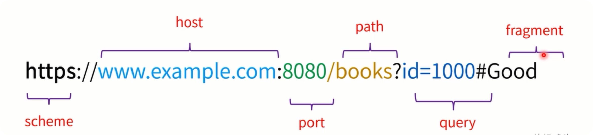
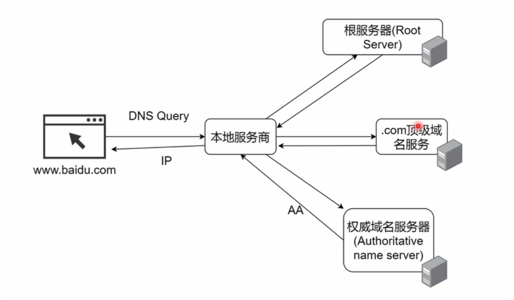
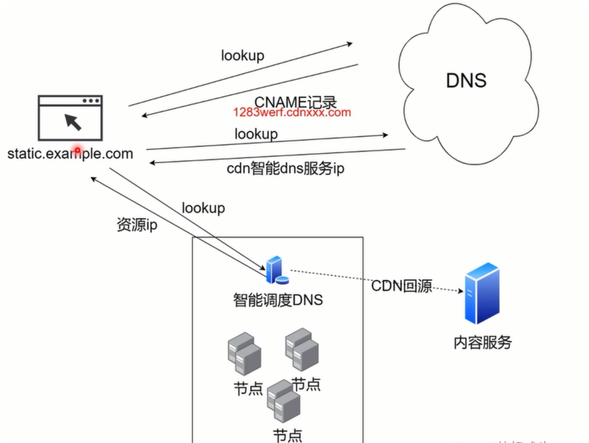
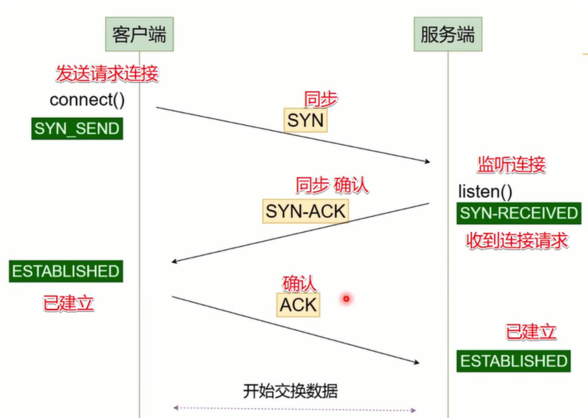
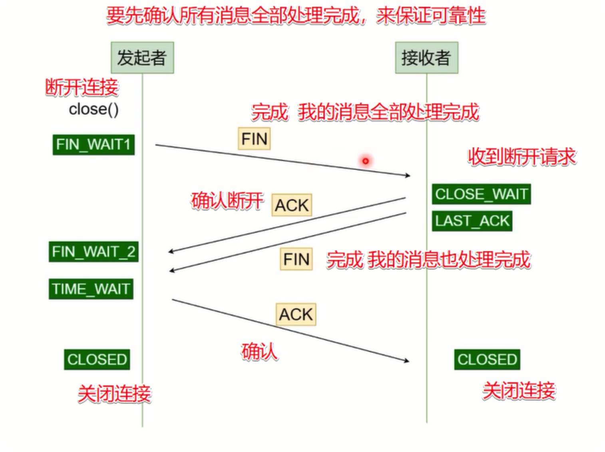
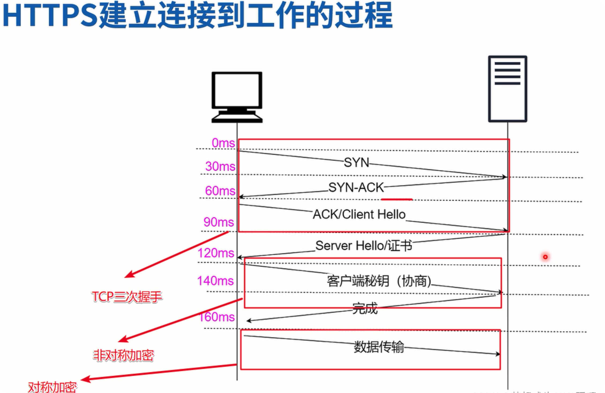
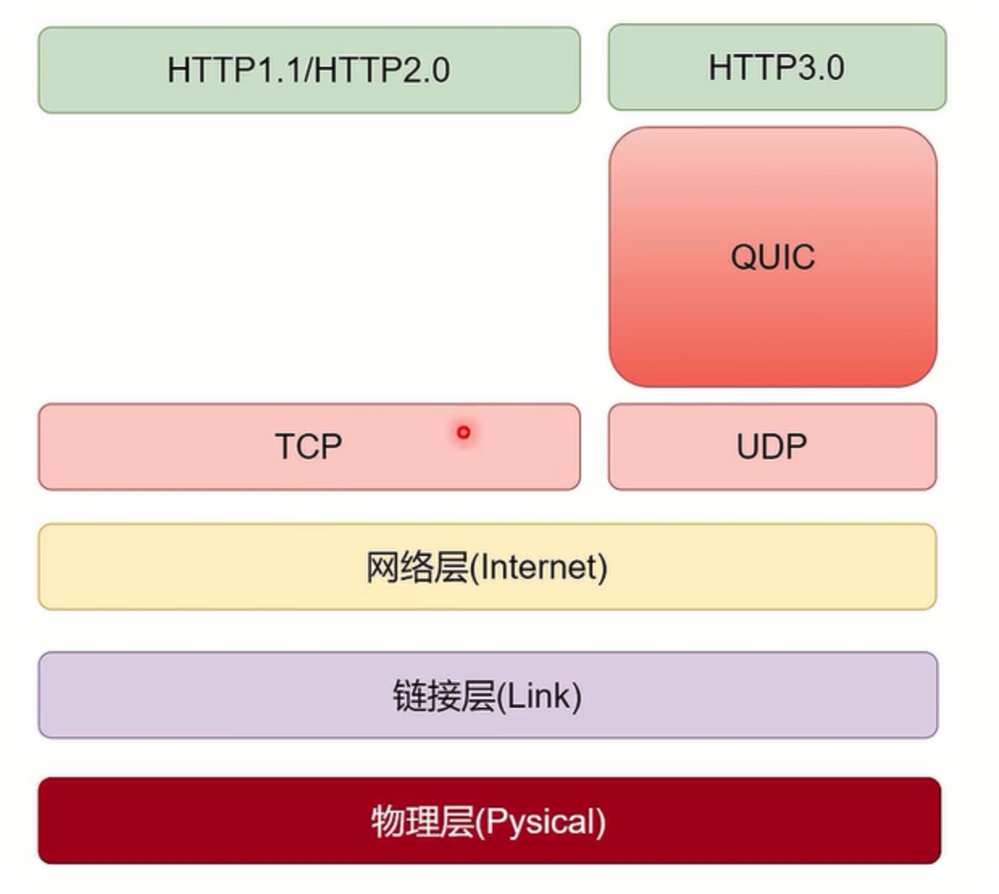
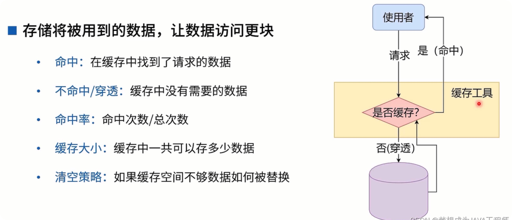

## OSI 七层模型

```js
· 开放式系统互联模型（Open System UbterConnection Model）
· 世界范围内的网络标准概念模型
· OSI的努力让互联网协议逐渐走向标准化

1. 应用层
定义了网络主机提供的方法和接口
往往直接对应用户行为
例如: HTTP、FTP、SMTP

2. 展示层
也被成为语法层
将数据转化为传输格式，保留语义，如 序列化、加密解密、字符串的编码和解码

3. 会话层
提供管理会话的方法
提供对底层连接断断续续的隐藏，

4. 传输层
提供主机到主机的数据通信能力
建立连接保证数据封包发送、接受的顺序一致
提供可靠性
提供流控制

5. 网络层
提供数据在逻辑单元之间的传递能力

6. 数据链路层
提供数据在设备和设备间的传输能力

7. 物理层
定义底层一个个位（bit）的数据如何变为物理信号
```

## TCP/IP 协议群（互联网协议群）

```js
1. 应用层
负责抽象用户的数据

2. 传输层
负责点到点的传输，主机到主机
有两个协议 TCP/UDP

3. 网络层
负责将分包从一个IP地址送到另一个IP地址

4. 链接层
负责设备到设备之间的传输

5. 物理层
负责关电信号的传输
```

## URL 资源



## DNS

```js
Domain Name System
域名系统

我们输入一个域名  huangjianxin.cn，但是并不知道地址，于是DNS将域名解析为39.108.224.218
```



## CDN

```js
内容发布网络

基于地理位置的分布式代理服务器/数据中心
1. 提供高可用
2. 提升性能
3. 提升体验
```



## curl

```js
传输一个url

在终端中可以模拟浏览器发送请求

curl https://www.baidu.com


查看请求头
curl -I www.baidu.com
```

## TCP 连接-三次握手

tcp 三次握手，是为了确保双方都在线



## TCP 断开连接-四次挥手



## 状态码

```js
1xx: 提供信息
- 100 continue
- 101 切换协议

2xx: 成功
- 200 OK
- 201 Created 已创建
- 202 Accepted 已接受
- 203 非权威内容
- 204 没有内容
- 205 重置内容
- 206 服务器下发了部门内容

3xx: 重定向
- 300 返回选项列表
- 301 永久重定向
- 302 暂时重定向、资源被找到
- 303 用来代替302
- 304 没有修改
- 305 需要代理
- 307 临时重定向
- 308 永久重定向

301 和 308的区别
共同点：资源被永久重定向到新地址
差异：
	- 客户端收到308请求后，之前是methods，那么之后也延用这个（GET/POST/PUT/DELET）
	- 客户端收到301请求后，通常用户会像新地址发起GET请求

302/303/307的区别
共同点： 资源临时放到新地址
差异：
	- 302会把所有请求重定向到GET
  - 303使用GET方法重定向资源
  - 304会按照以前的methods进行重定向


4xx: 客户端错误
- 400 请求格式错误
- 401 没有授权
- 402 请先付费
- 403 禁止访问
- 404 没有找到
- 405 方法不被允许
- 406 服务端可以提供的内容和客户期待的不同

5xx: 服务端错误
- 500 内部服务器错误
- 501 没有实现
- 502 网关错误
- 503 服务不可用
- 504 网关超时
- 505 版本不支持


```

## 请求头信息

```js
User-Agent
	- 帮助区分客户端特性的字符串
	· 操作系统
  · 浏览器
  · 制造商 （手机类型）
  · 内核版本
  · 版本号

Origin
	- 描述请求来源地址

Accept
	- 建议服务端返回何种媒体类型
	· */* 代表所有类型

Accept-Encoding
	- 建议服务端发送那种编码（压缩算法）
	· deflate,gzip;q=1.0,*;q=0.5

Accept-Language
	- 建议服务器传递哪种语言

Referer
	- 告诉服务器打开当前页面的上一张你页面的URL，如果时Ajax请求，那么就高告诉服务端发送的请求的URL是什么
	- 用户从A => B, 那么Rederer保存的就是A的URL，形成一条链路，追溯用的行为

Connection
	- 决定连接是否在当前事务完成后关闭
	· Http1.0默认是close
	· Http1.1后默认是keep-alive

```

## 响应头信息

```js
Content-Type
	- 帮助区分资源的媒体类型
	· text/html
 	· text/css
	· application/json
  · image/jpeg
  · ......
```

## 对称加密和非对称加密

```js
非对称加密安全性更好
对称加密速度更快
通常混合使用（利用非对称加密协商秘钥，然后进行对称加密）
```

## HTTP 和 HTTPS

```js
HTTP协议传输的数据都是未加密的，也就是明文的，因此使用HTTP协议传输隐私信息非常不安全，为了保证这些隐私数据能加密传输，于是网景公司设计了SSL（Secure Sockets Layer）协议用于对HTTP协议传输的数据进行加密，从而就诞生了HTTPS。

1、https协议需要到ca申请证书，一般免费证书较少，因而需要一定费用。

2、http是超文本传输协议，信息是明文传输，https则是具有安全性的ssl加密传输协议。

3、http和https使用的是完全不同的连接方式，用的端口也不一样，前者是80，后者是443。

4、http的连接很简单，是无状态的；HTTPS协议是由SSL+HTTP协议构建的可进行加密传输、身份认证的网络协议，比http协议安全。
```

### HTTPS 连接



### HTTP2.0 和 HTTP3.0

```js
HTTP2.0
	- 多个请求多路复用
	- 防止队头阻塞
	- 压缩HTTP头部
	- 服务端推送
```



## 缓存



### 强制缓存

```js
强制使用缓存，不去服务器对比（缓存生效不再发送请求）

应用于一些长久不会变化的资源

// 最大的强制缓存时间
Cache-Control: max-age=600


```

### 协商缓存

```js
协商使用缓存，每次需要向服务器请求对比，缓存生效不传回body

强制缓存优先级高于协商缓存
```

## 同源协议

```js
协议、主机、端口相同的两个网址是同源，否则则是不同源
```

## 跨域

```js
1. JSONP
利用不限制跨域脚本执行的特点


2. CORS
跨域资源公用，使用额外HTTP头允许指定的源和另一个源进行交互

3. 代理
利用代理将不同源的资源代理到同源的资源
```

## restful 风格

```js
// restful风格可以帮助我们更好的管理请求资源，每一个资源都对应着增删改查

// 下面以axios和node为例，实现对商品的增删改查

// 增 post
axios.post('/Goods', {
  id: 10,
})
// node
const { id } = req.body

// 删 delete
axios.delete('/Goods', {
  data: {
    id: 20,
  },
})
// node
const { id } = req.body

// 改 put
axios.put('/Goods', {
  id: 30,
})
// node
const { id } = req.body

// 查 get
axios.get('/Goods', {
  params: {
    id: 40,
  },
})
// node
const { id } = req.query
```
