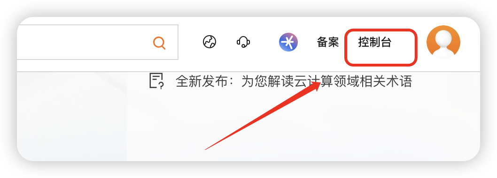
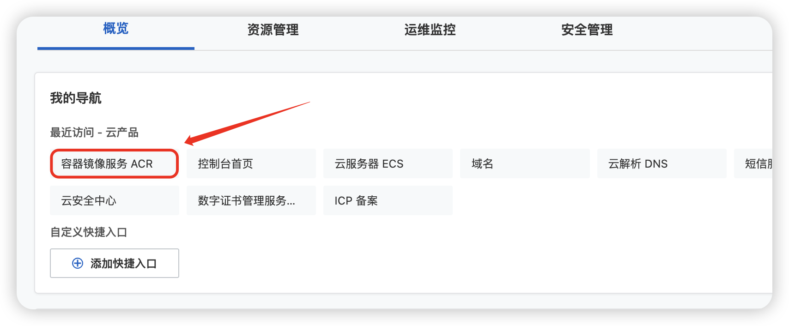
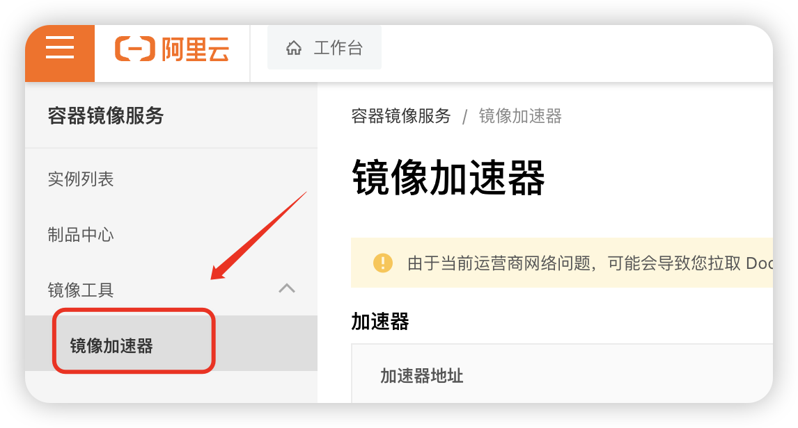

## 获取镜像

国内从 `Docker Hub` 拉取镜像有时会遇到困难，此时可以配置镜像加速器。国内很多云服务商都提供了国内加速器服务，例如：

- [阿里云加速器(点击管理控制台 -> 登录账号(淘宝账号) -> 容器镜像服务 ACR -> 左侧镜像工具 -> 镜像加速器 -> 复制加速器地址)](https://cr.console.aliyun.com/cn-hangzhou/instances)

操作截图：







- [网易云加速器 `https://hub-mirror.c.163.com`](https://www.163yun.com/help/documents/56918246390157312)
- [百度云加速器 `https://mirror.baidubce.com`](https://cloud.baidu.com/doc/CCE/s/Yjxppt74z#使用dockerhub加速器)

**由于镜像服务可能出现宕机，建议同时配置多个镜像。**

## 配置镜像

在任务栏托盘 Docker 图标内右键菜单选择 `Settings`，打开配置窗口后在左侧导航菜单选择 `Docker Engine`，在右侧像下边一样编辑 json 文件，之后点击 `Apply & Restart` 保存后 Docker 就会重启并应用配置的镜像地址了。

1. 在 `Docker Desktop` 界面中点击右上角的设置。
2. 选择左侧的 `Docker Engine`。
3. 将下面的镜像地址进行复制和替换。
4. 点击 `Apply&restart`。


```json
"registry-mirrors": [
  "你的阿里云镜像地址",
  "https://mirror.baidubce.com",
  "https://hub-mirror.c.163.com"
]
```

