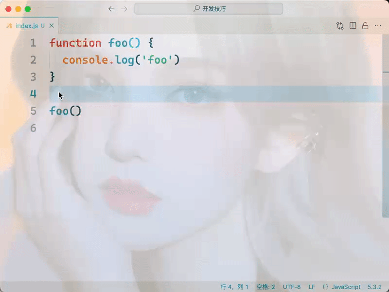

## 安装

直接去 [Visual Studio Code 官网](https://code.visualstudio.com/Download) 进行下载即可。

!>  Window 电脑下载后，如果出现无法更新的情况、找不到更新按钮或提示：您正以管理员身份运行 Visual Studio Code 用户范围的安装，更新功能会被禁用。

记得选择 win 下面的 System Installer x64 而不是 User Installer。


## 键盘操作

VsCode 的快捷键非常强大，很多需要鼠标的进行的操作，使用键盘同样可以。

### 快速选中整个单词

使用鼠标的情况下，我们可以通过双击想要选中的单词来实现选中整个单词，但是我们可以利用快捷键来实现。并且使用快捷键可以选择接下来重复的单词，方便我们快速编辑。

<!-- tabs:start -->

#### **Mac**

`Cmd + D`

#### **Windows**

`Ctrl + D`

<!-- tabs:end -->


### 移动光标到文件的开头或结尾

<!-- tabs:start -->

#### **Mac**

`Cmd + 上下方向键`

#### **Windows**

`Ctrl + Home` 或 `Ctrl + End`

<!-- tabs:end -->



### 在光标所在位置连续选中多行内容

`Shift + 上下左右方向键`


### 选择括号所有内容

这个比较常用，比如我们将一个函数或对象进行迁移或复制。我们只需光标在括号里面的最外层，然后摁下 `Cmd + Shift + P`（Windows 上摁下 `Ctrl + Shif + P`），这时上方会弹出**命令面板**，我们输入或选择“选择括号所有内容即可”，首次可能需要输入，之后只需要快速选择即可。

> 注：这些常用的操作，可以用命令面板进行指示，也可以绑定自定义的快捷键。


### 删除当前行

删除当前行也是一个常用的操作，将光标移动到想要删除行的行位置上，摁下 `Cmd + Shift + P` 呼出**命令面板**，输入“删除行” 即可。


### 自定义快捷键

前面我们提到，VS Code 内置了很多的命令，但是并没有为每个命令都提供一个快捷键，毕竟快捷键的组合总是有限的。不过 VS Code 提供了快捷键的修改和自定义功能，这样你就可以根据自己的使用习惯，给自己常用的命令指定顺手的快捷键。

摁下 `Cmd + Shif + P` 打开**命令面板**，然后搜索 “**首选项：打开键盘快捷方式”**然后执行，这时会出现相应的界面。


然后通过搜索找到你希望修改快捷键的命令，双击，接下来你只要按下你期望的快捷键，最后按下回车键就可以了。

比如，你可以搜索“**选择括号内所有内容**”，双击，按下 `Cmd + Shift + ]`，然后按下回车，这个快捷键就绑定上了。


搜索“**删除行**”，双击，按下 `Cmd + Shift + Backspace`，然后按下回车，这个快捷键就绑定上了。


## 代码行编辑

### 插入换行符

`Enter` 键的基础作用是能在编辑器里光标所在的位置添加一个换行符。但是很多时候你可能并不是单纯地要将一行分成两段，而是希望在这行的下面或者上面开始一段新的代码。

这个功能对应的快捷键非常好记，它跟 `Enter`键十分接近。当你想在当前行的下面新开始一行时，你只需按下：

<!-- tabs:start -->

#### **Mac**

`Cmd + Enter`

#### **Windows**

`Ctrl + Enter`

<!-- tabs:end -->

而当你想在当前行的上面新开始一行时，你只要按下：

<!-- tabs:start -->

#### **Mac**

`Cmd + Shift + Enter`

#### **Windows**

`Ctrl + Shift + Enter`

<!-- tabs:end -->


### 剪切行

 只要光标在当前行，摁下下面快捷键即可，不需要选中当前行的内容。

<!-- tabs:start -->

#### **Mac**

`Cmd + x`

#### **Windows**

`Ctrl + x`

<!-- tabs:end -->

### 复制行

方式一：

<!-- tabs:start -->

#### **Mac**

摁下 `Cmd + C`复制后，再摁下 `Cmd + v` 粘贴即可。

#### **Windows**

摁下 `Ctrl + C`复制后，再摁下 `Ctrl + v` 粘贴即可。

<!-- tabs:end -->

方式二：

 摁下下方快捷键后，那就可以复制这几行，然后粘贴到当前行的上面或者下面。

<!-- tabs:start -->

#### **Mac**

`Option + Shift + 上下方向键`

#### **Windows**

`Alt + shift + 上下方向键`

<!-- tabs:end -->

### 移动行

<!-- tabs:start -->

#### **Mac**

`Option + 上下方向键`

#### **Windows**

`Alt + 上下方向键`

<!-- tabs:end -->

## 撤销光标移动

撤销光标的移动和选择。有的时候你移动完光标之后，又希望把光标回退到上一个位置。

<!-- tabs:start -->

#### **Mac**

`Cmd + U`

#### **Windows**

`Ctrl + U`

<!-- tabs:end -->

## 调整字符大小

选中一串字符，然后在**命令面板**里运行“**转换为大写**”或 “**转换为小写**”, 来变换字符的大小写。


## 代码缩进

向右缩进一个 `tab`：`Tab`

向左缩进一个 `tab`：`Shift + Tab`

## 添加代码注释

单行注释：

<!-- tabs:start -->

#### **Mac**

`Cmd + /`

#### **Windows**

`Ctrl + /`

<!-- tabs:end -->

多行注释：

<!-- tabs:start -->

#### **Mac**

`Shift + Alt + A`

#### **Windows**

`Shift + Opthin + A`

<!-- tabs:end -->


## 鼠标文本选择

### 鼠标点击选择

在VS Code中，你单击鼠标左键就可以把光标移动到相应的位置。而双击鼠标左键，则会将当前光标下的单词选中。连续三次按下鼠标左键，则会选中当前这一行代码。最后是连续四次按下鼠标左键，则会选中整个文档。

### 选择指定内容

在第一个光标选择的时候，摁下 `Shift` 键，再点击想要选择的内容结尾即可。


## 文本拖放功能

### 拖放改变内容位置

在 VS Code中，我们除了能够使用鼠标来选择文本以外，还能够使用鼠标对文本进行一定程度的修改，我们把它称为拖放功能（drag and drop）。

我们可以选择某段内容，然后鼠标移动到想要放置的位置即可。


### 拖放粘贴内容

如果我们在拖拽这段文本的同时，按下 `Option` 键（Windows 上是 `Ctrl` 键），鼠标指针上会多一个加号，这时候我们再移动鼠标或虚拟光标至我们想要的位置，然后当我们松开鼠标左键的时候，这段文本将会被复制粘贴到虚拟光标所在的位置，也就是我们既定的目标位置。


## 多光标

在我们的日常编码过程中，有很多工作，它本身就是具有“重复”属性的。比如你需要把多个单词的第一个字母从小写变成大写，这种跟业务逻辑相关的重复性操作，编辑器很难为它们一个个单独做优化。

而 VS Code 的多光标特性其实就是用来解决这类问题的。当你在一个文本框或者某个输入框里打入字符时，会有一个竖线来显示你将要输入文字的位置，这就是“光标”。多光标特性允许你在输入框的多个位置创建光标，这样你就可以在多个不同的位置同时输入文字或者执行其他操作。

在键盘上按住 `Option`（Windows 上是 `Alt`），然后鼠标点在第二个光标位置上，那么第二个光标就创建好了。


## 代码跳转和链接

### 跳转指定函数

除了能够使用鼠标进行代码选择、编辑、预览之外，我们还可以借助鼠标来完成跳转操作。

我们还是把鼠标移动到示例代码的第五行 foo 上，然后按下 `Cmd`（Windows 上是 `Ctrl`） 键，这时候 foo下面出现了一个下划线。然后当我们按下鼠标左键，就跳转到了 foo函数的定义处。

### 打开链接

当我们在编写 Markdown 这样的非编程语言的文档时，也可以通过 `Cmd + 鼠标左键`（Windows 上是 `Ctrl + 鼠标左键`）来打开超级链接。

## 文件和行跳转

### 文件跳转

VS Code 在命令面板里提供了一种支持搜索的文件跳转方式。当你按下 `Cmd + P` （Windows 上是 `Ctrl + P`）时，就会跳出一个最近打开文件的列表，同时在列表的顶部还有一个搜索框。在这个搜索框来快速地找到你想要的文件，然后按下 `Enter` 键直接打开。

### 行跳转

打开某一个文件之后，你的另外一个需求可能就是要快速跳转到这个文件的某一行。只需要按下 `Ctrl + G`，紧接着编辑器就会出现一个输入框，然后输入想要跳转的行数即可。

## 自定义代码片段

### 设置代码片段

首先，我们打开命令面板，搜索“**配置用户代码片段**”（Configure User Snippets）并且执行，然后在输入“**新建全局代码片段**”，然后输入代码片段的名称（注意，这个只是代码片段的名称，用于以后方便查找和修改，不是代码片段的**触发简写片段**）。

输入名称之后，我们就能看到一个 JSON 文件被打开了，这个文件里的内容，现在都是被注释掉的。如下：

```json
{
	// Place your 全局 snippets here. Each snippet is defined under a snippet name and has a scope, prefix, body and 
	// description. Add comma separated ids of the languages where the snippet is applicable in the scope field. If scope 
	// is left empty or omitted, the snippet gets applied to all languages. The prefix is what is 
	// used to trigger the snippet and the body will be expanded and inserted. Possible variables are: 
	// $1, $2 for tab stops, $0 for the final cursor position, and ${1:label}, ${2:another} for placeholders. 
	// Placeholders with the same ids are connected.
	// Example:
	// "Print to console": {
	// 	"scope": "javascript,typescript",
	// 	"prefix": "log",
	// 	"body": [
	// 		"console.log('$1');",
	// 		"$2"
	// 	],
	// 	"description": "Log output to console"
	// }
}
```

简单的说一下这里面的字段的含义和作用：

- scope：代码片段生效的语言，比如“javascript,typescipt”，那么代码片段只会在这两种语言触发。
- prefix：代码片段的触发片段，也叫简写片段。
- body：代码片段的主体内容。
- description：代码片段的描述内容。

接下来推荐一个可以根据你的内容自动生成代码片段的网站：[代码片段生成](https://snippet-generator.app/?description=&tabtrigger=&snippet=&mode=vscode)。

