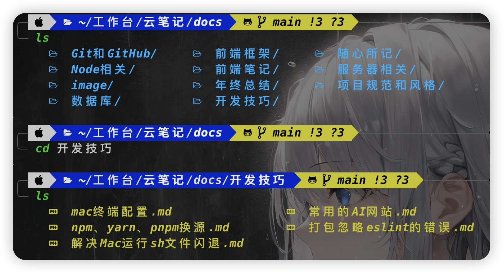

## colorls

> colorls可以在终端将目录下的文件以图案的形式列出来

### 效果图



### colorls安装

命令行中依次执行如下步骤即可安装成功

1. 安装`ruby`

```shell
$ brew install ruby
```

2. 安装`colorls`，如果遇到没有权限，可以使用`sudo`来安装

```shell
$ sudo gem install colorls
```

3. 接下来使用`colorls`

```shell
$ colorls
```

### 消除警告

如果这个时候控制台出现以下警告：

```shell
/System/Library/Frameworks/Ruby.framework/Versions/2.6/usr/lib/ruby/2.6.0/universal-darwin23/rbconfig.rb:21: warning: Insecure world writable dir /opt/homebrew/bin in PATH, mode 040777
```

大概意思是不安全的写权限，目录是 `/opt/homebrew/bin`。于是我们把这个目录的写权限去掉。

```shell
$ sudo chmod -R go-w /opt/homebrew/bin
```

如果还是报错，那么再往上给权限。

```shell
$ sudo chmod -R go-w /opt/homebrew
```

### 别名配置

进入`.zshrc`文件中配置`colorls`的别名。

```shell
$ vim ~/.zshrc
```

然后输入以下的内容后，摁下`esc`后输入`wq`保存退出即可。

```shell
alias ls=colorls
alias ll="colorls -ll"
alias la="colorls -la"
```

或者直接在终端输入：

```shell
$ echo 'alias ls = colorls' >> ~/.zshrc
$ echo 'alias ll="colorls -ll"' >> ~/.zshrc
$ echo 'alias ll="colorls -la"' >> ~/.zshrc

# 重载文件
$ source ~/.zshrc
```

### 参考资料

MacOS-终端美化-colorls：https://www.cnblogs.com/godots/p/14799634.html

Github仓库：https://github.com/ksxrubyapps/colorls?tab=readme-ov-file#recommended-configurations

解决警告：https://www.zimuwu.cn/itarticle/shell/307.html
