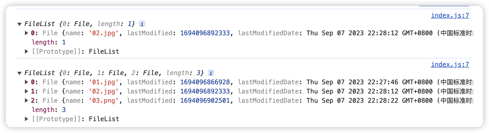
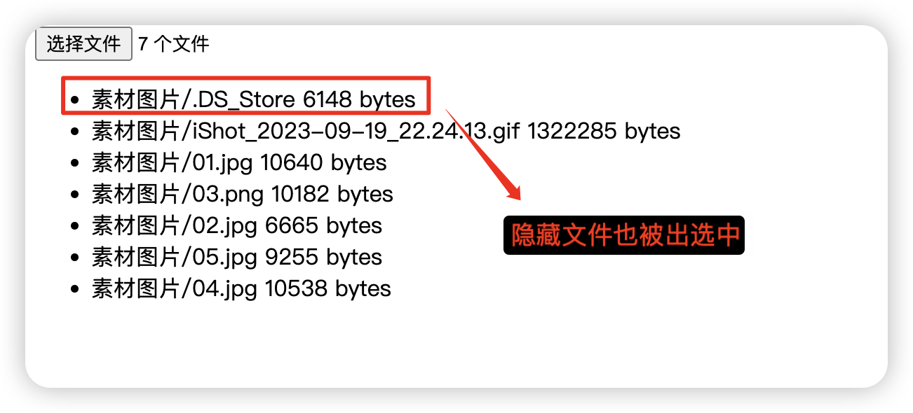
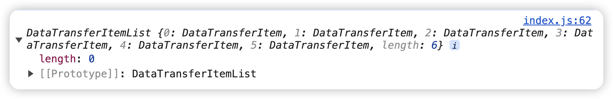

> 本案例的完整代码地址：https://github.com/xinxin1228/docs_develop_tips/tree/main/02_%E5%A4%9A%E6%96%87%E4%BB%B6%E4%B8%8A%E4%BC%A0

在前端开发中，实现多文件拖拽上传和点击上传是一个常见的需求，可以让用户方便地上传多个文件。本文将介绍如何使用`HTML5`和`JavaScript`来实现这两种上传方式。

### 点击上传

#### 上传文件

点击上传允许用户通过点击按钮或者区域来选择文件进行上传。实现这一功能需要借助HTML5的 `input` 元素和 `change` 事件。

首先，在HTML中创建一个 `input[type=file]` 元素，并为其添加 `multiple` 属性以允许用户选择多个文件。

```html
<input type="file" id="input" multiple />
```

然后我们监听它的 `onChange` 事件可以拿到它的选择的数据，所有选择文件列表都会放在 `e.target.files` 中，它是一个 `FileList` **类数组**对象。

```js
inputEl.addEventListener('change', e => {
  console.log(e.target.files)
})
```

我们分边上传一个或多个文件，打印的截图如下：



#### 上传文件夹

点击上传文件夹的方法目前主要有两种，一种是给 `input` 元素上添加 [webkitdirectory](https://developer.mozilla.org/zh-CN/docs/Web/API/HTMLInputElement/webkitdirectory) 属性，另外一种是使用 [showDirectoryPicker()](https://developer.mozilla.org/zh-CN/docs/Web/API/Window/showDirectoryPicker) 方法。

**webkitdirectory**

使用 `webkitdirectory` 可以让用户选择一个目录而并非选择文件。在选择文件目录后，该目录及其整个内容层次结构将包含在所选项目集内。**另外，默认隐藏的文件夹也会被选中**。

!> 不过需要注意的是，加上该属性之后，用户就无法再选择文件，只能选择文件夹。

```html
<input type="file" id="input" multiple webkitdirectory />
<ul class="file-list"></ul>
```

可以在 `webkitRelativePath` 中拿到该文件基于上传文件夹的路径。我们可以将这些路径在页面上输出出来。

```js
const $ = dom => document.querySelector(dom)

const inputEl = $('#input')
const ulEl = $('.file-list')

inputEl.addEventListener('change', e => {
  console.log(e.target.files)

  const doms = document.createDocumentFragment()

  for (const file of e.target.files) {
    const item = document.createElement('li')
    item.textContent = `${file.webkitRelativePath}  ${file.size} bytes`
    doms.append(item)
  }

  ulEl.append(doms)
})
```

输出的结果截图如下：



**showDirectoryPicker**

!>  此项功能仅在一些[支持的浏览器](https://developer.mozilla.org/zh-CN/docs/Web/API/Window/showDirectoryPicker#浏览器兼容性)的[安全上下文](https://developer.mozilla.org/zh-CN/docs/Web/Security/Secure_Contexts)（HTTPS）中可用。并且这目前还属于实验性技术。

`Window` 接口的 `showDirectoryPicker()` 方法用于显示一个目录选择器，以允许用户选择**一个**目录。然后需要我们遍历每一个子文件夹来获取文件。

```html
<button id="btn">showDirectoryPicker() 方法上传</button>
```

我们可以使用下面的方法递归获取到当前选择的文件夹所有的文件。

```js
btn.addEventListener('click', async () => {
  const directoryHandle = await window.showDirectoryPicker()
  const entriesList = []

  async function readEntries(dir, rootDirName) {
    for await (const entry of dir.values()) {
      if (entry.kind === 'directory') {
        await readEntries(entry, `${rootDirName}/${entry.name}`)
      } else if (entry.kind === 'file') {
        const file = await entry.getFile()
        const path = `${rootDirName}/${entry.name}`

        entriesList.push({ file, path })
      }
    }
  }

  await readEntries(directoryHandle, `/${directoryHandle.name}`)

  console.log('entriesList', entriesList)
})
```

### 拖拽上传

#### 上传文件(夹）

对于拖拽上传来说，不像点击上传一样需要专门区分文件上传和文件夹上传，我们只需要拖拽任意想要上传的内容即可。实现这一功能需要借助 `HTML5` 的 `drag` 事件和 `drop` 事件

首先，我们需要在 HTML 中创建一个接受拖拽文件的区域：

```html
<div class="drop">拖拽文件来上传</div>
```

我们通过主要通过监听该元素上的 `drop` 事件来获取到拖拽选取的文件列表，其值放在了 `e.dataTransfer.items` 上。

```js
// 拖放进入时触发
drop.addEventListener('dragover', e => {
  e.preventDefault()
})
// 拖放松手时触发
drop.addEventListener('drop', e => {
  e.preventDefault()
  
  console.log(e.dataTransfer.items)
})
```

打印的结果如图所示，是一个 `DataTransferItemList` 对象。



接下来我们可以遍历该对象来递归找出所有的文件。

```js
drop.addEventListener('drop', e => {
  e.preventDefault()
  // console.log(e.dataTransfer.items)

  const entriesList = [] // 上传的所有文件列表
  const emptyDirList = [] // 空文件夹列表

  Promise.allSettled(
    Array.from(e.dataTransfer.items).map(dir =>
      readEntries(dir.webkitGetAsEntry())
    )
  ).then(() => {
    console.log('所有上传的文件夹', entriesList)
    console.log('空文件夹列表', emptyDirList)
    renderFileTree(entriesList)
  })

  // 递归读取文件信息
  async function readEntries(entry) {
    // 文件夹
    if (entry.isDirectory) {
      const directoryReader = entry.createReader()

      let entries = await new Promise(resolve => {
        let results = []
        directoryReader.readEntries(list => {
          results = [...results, ...list]
          if (list.length > 0) {
            resolve(results)
          } else {
            emptyDirList.push(entry.fullPath)
            resolve(results)
          }
        })
      })

      for (const entry of entries) {
        await readEntries(entry)
      }
    }
    // 文件
    else {
      const file = await getFileObject(entry)

      entriesList.push({ file, path: entry.fullPath })
    }
  }

  // 从FileSystemFileEntry获取File对象
  async function getFileObject(fileEntry) {
    return new Promise(resolve => {
      fileEntry.file(resolve)
    })
  }
})
```

### 综合上传

最后，我们可以将点击上传也结合在该拖拽上传的元素，只需要将之前的 `input` 元素隐藏，然后在点击拖拽上传的元素时调用 `input` 元素的 `click` 事件即可。

```html
<div class="drop">
  拖拽文件来上传
  <input type="type" id="drop-btn" style="display: none" />
</div>
```

```js
drop.addEventListener('click', () => {
  // 调用 drop-btn 的点击事件来触发点击上传
  dropBtn.click()
})
```

