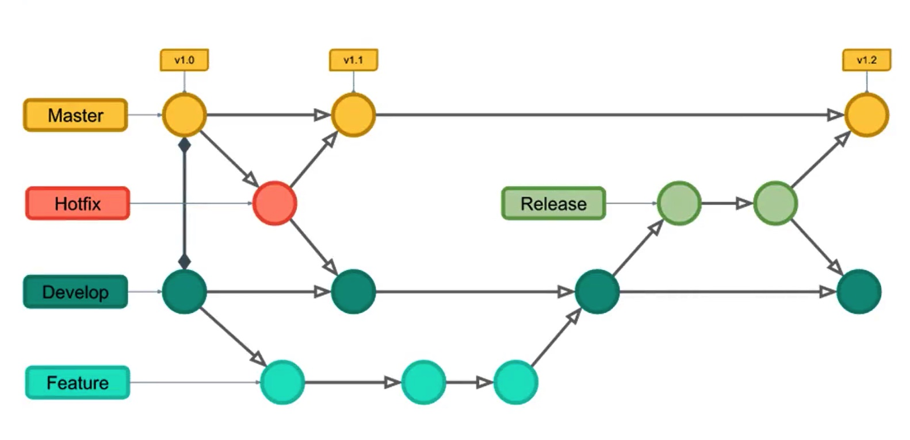

## commit 格式

```js
<type>(<scope>): <subject>
// 注意冒号 : 后有空格
// 如 feat(user): 增加用户中心的 xx 功能

type 必填，表示提交类型，值一般有以下几种：

feat：新功能 feature
bug：测试反馈 bug 列表中的 bug 号
fix： 修复 bug
ui：更新UI；
docs： 文档注释变更
style： 代码格式(不影响代码运行的变动)；
refactor： 重构、优化(既不增加新功能，也不是修复bug)；
perf： 性能优化；
release：发布；
deploy：部署；
test： 增加测试
chore： 构建过程或辅助工具的变动
revert： 回退
build： 打包

scope 表示 commit 的作用范围，如用户中心、购物车中心，也可以是目录名称，一般可以限定几种；

subject 用于对 commit 进行简短的描述；
```

## 强制性

- 使用 `commitlint` 、`commitizen` 和 `husky` 来进行提交检查
- 使用 `cz-commitlint-changelog` 范命令行提示消息

## 工作流



### 主分支（main）

永远是可用的稳定版本，不能直接在该分支上开发

### 开发分支

```js
develop === 开发主分支，所有新功能以这个分支来创建自己的开发分支，该分支只做只合并操作，不能直接在该分支上开发
feature-xxx === 功能开发分支，在develop上创建分支，以自己开发功能模块命名，功能测试正常后合并到develop分支
feature-xxx-fix === 功能bug修复分支，feature分支合并之后发现bug，在develop上创建分支修复，之后合并回develop分支。PS:feature分支在申请合并之后，未合并之前还是可以提交代码的，所以feature在合并之前还可以在原分支上继续修复bug

```

### 修补 Bug(hotfix)

用来修复 `main` 分支上的 bug，修复之后合并到 `main` 分支

### 注意事项

- 一个分支尽量开发一个功能模块，不要多个功能模块在一个分支上开发。
- `feature` 分支在申请合并之前，最好是先 `pull` 一下 `develop` 主分支下来，看一下有没有冲突，如果有就先解决冲突后再申请合并。
