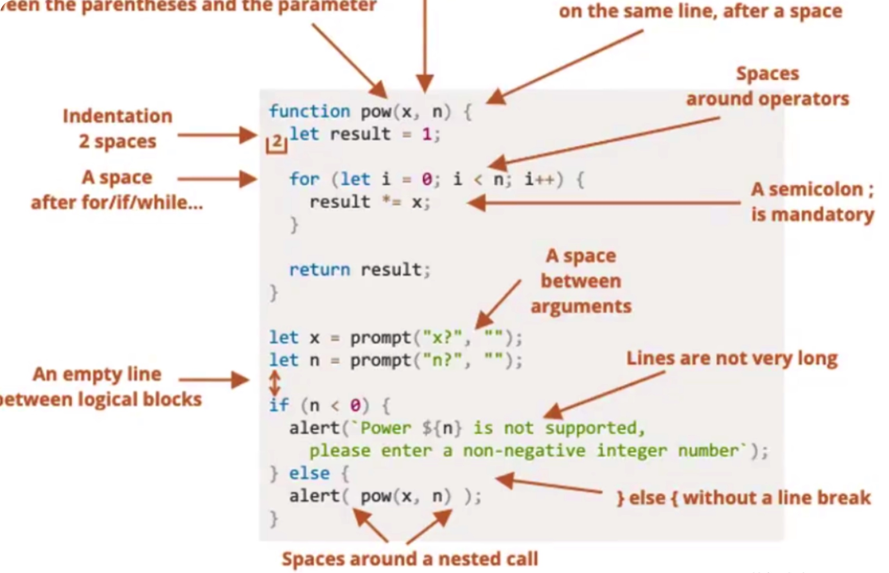

## 编码规范



## .editorconfig

EditorConfig 有助于为不同 IDE 编辑器上处理同一项目的多个开发人员维护一致的编码风格。

```shell
# http://editorconfig.org

root = true

[*] # 表示所有文件适用
charset = utf-8 # 设置文件字符集为 utf-8
indent_style = space # 缩进风格（tab | space）
indent_size = 2 # 缩进大小
end_of_line = lf # 控制换行类型(lf | cr | crlf)
trim_trailing_whitespace = true # 去除行首的任意空白字符
insert_final_newline = true # 始终在文件末尾插入一个新行

[*.md] # 表示仅 md 文件适用以下规则
max_line_length = off
trim_trailing_whitespace = false
```

## .prettierrc

功能强大的格式化工具

```shell
# 前端项目
# 说明：单引号 不保留分号
{
  "useTabs": false,
  "tabWidth": 2,
  "printWidth": 80,
  "singleQuote": true,
  "trailingComma": "none",
  "semi": false,
  "endOfLine": "auto"
}

# node端项目
# 说明：双引号 保留分号
{
  "useTabs": false,
  "tabWidth": 2,
  "printWidth": 90,
  "singleQuote": false,
  "trailingComma": "none",
  "semi": true,
  "endOfLine": "auto"
}
```

## .eslintrc

```shell
{
  "env": {
    "browser": true,
    "es2021": true
  },
  "extends": [
    "eslint:recommended",
    "plugin:@typescript-eslint/recommended",
    "plugin:prettier/recommended"
  ],
  "parser": "@typescript-eslint/parser",
  "parserOptions": {
    "ecmaVersion": "latest",
    "sourceType": "module"
  },
  "plugins": ["@typescript-eslint"],
  "rules": {
    "@typescript-eslint/no-inferrable-types": "off",
    "@typescript-eslint/no-explicit-any": "off",
    "@typescript-eslint/no-empty-function": "off",
    "@typescript-eslint/no-var-requires": "off",
    "no-undef": "off"
  }
}
```
